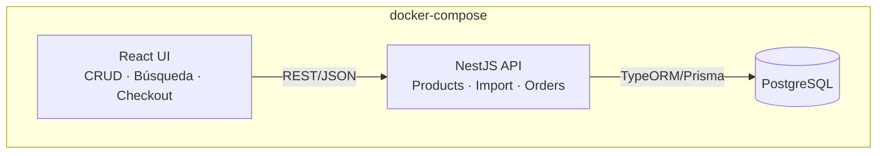
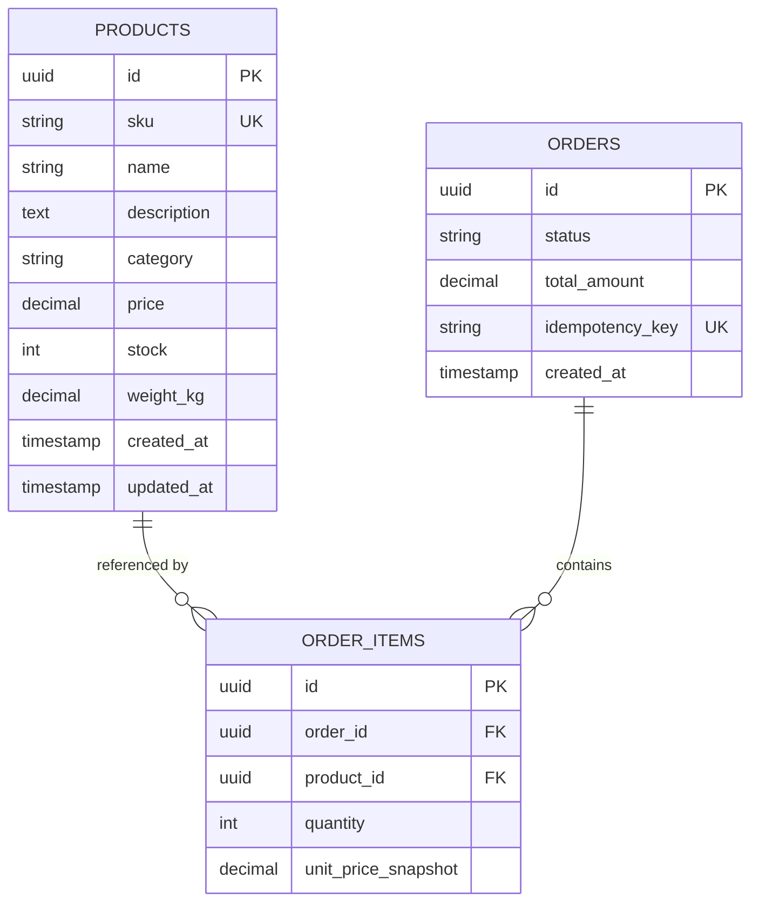
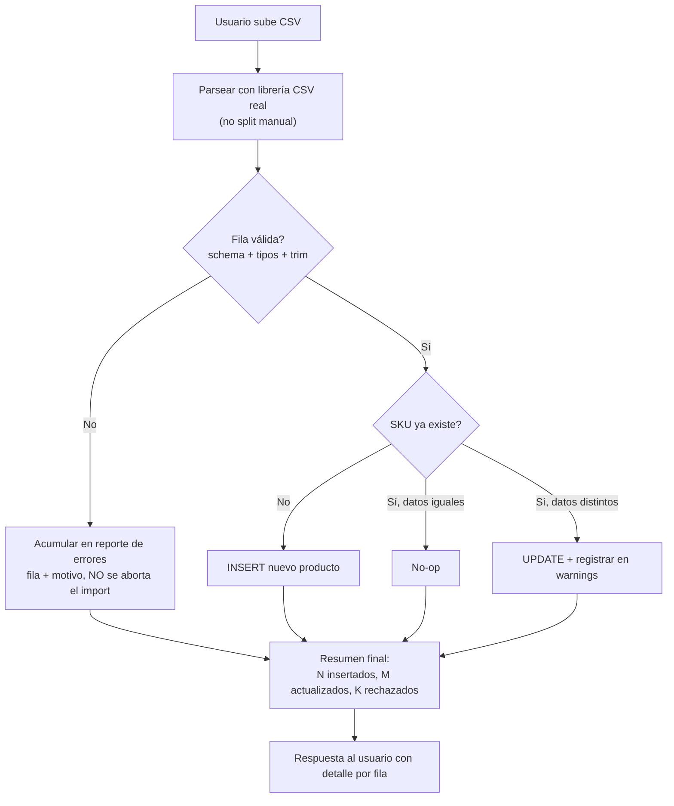
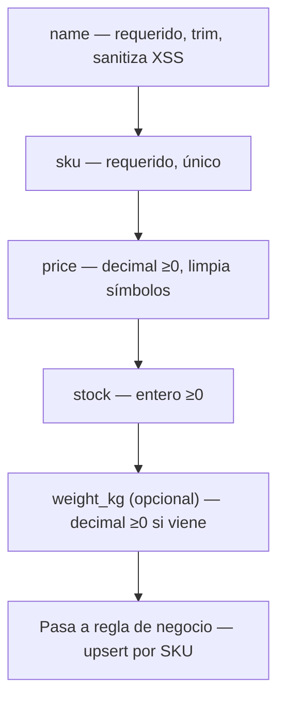
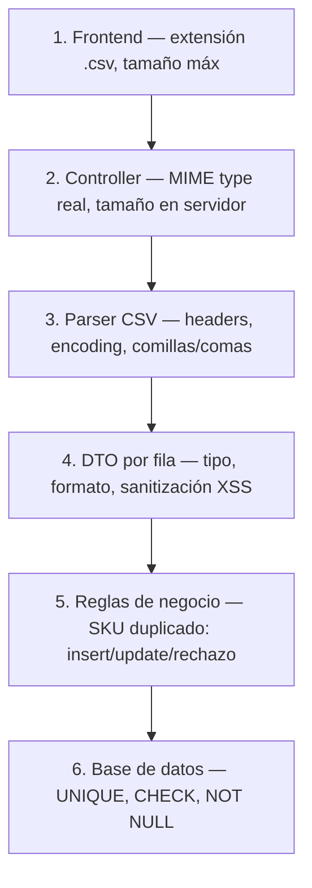
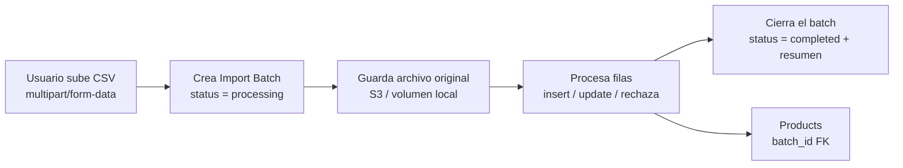
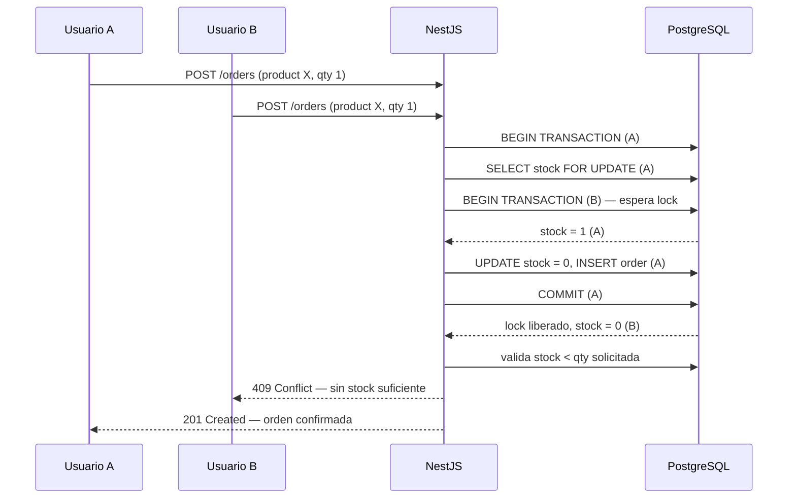

# LoanPro — Code Challenge E-Commerce | Open Spec

> Documento de diseño técnico previo a la implementación. Se documenta ANTES de escribir código
> porque el challenge lo pide explícitamente: *"queremos ver que hagas las preguntas correctas y
> guíes a la IA con tu experiencia y capacidad de anticipación"*.
>
> **Contexto clave**: LoanPro es una empresa de préstamos (fintech). Aunque el challenge es un
> e-commerce de juguete, lo trato con la mentalidad de un sistema financiero: transacciones
> atómicas, prevención de condiciones de carrera en dinero/inventario, trazabilidad (auditoría),
> y desconfianza por defecto de cualquier dato de entrada (el CSV incluye intentos de XSS y SQL
> injection — no es casualidad, es parte del test).

**CSV de ejemplo descargado**: `2026-08-26` (fecha de este análisis).

---

## Contexto para quien retome este proyecto (incluido Claude Code)

Este documento es el resultado de un proceso de diseño conversacional previo a escribir código,
hecho para un take-home challenge técnico de LoanPro (empresa de préstamos). El objetivo no es
solo pasar el checklist del challenge — es demostrar criterio de arquitectura senior aplicando
una mentalidad fintech a un dominio de e-commerce.

**Ya se hizo:**
- Análisis fila por fila del CSV de ejemplo real (`LoanPro_Code_Challenge_E-Commerce...csv`) —
  ver sección 1. Se encontraron errores de formato, filas vacías, payloads de XSS/SQLi
  intencionales, SKUs duplicados con datos conflictivos, y casos límite válidos que no deben
  rechazarse.
- Diseño de arquitectura (NestJS + React + PostgreSQL), modelo de datos, flujo de import CSV con
  validación por capas (sección 4.5), estrategia de concurrencia para stock (sección 5), y
  patrones de diseño a aplicar (sección 6).
- Decisiones de alcance: sin autenticación (decisión consciente, no un olvido), sin pasarela de
  pago real, sin locking optimista — todas justificadas en sus secciones.
- Estructura de proyecto y decisiones de stack de frontend/infra (sección 10).

**Pendiente:**
- Analizar dos templates existentes del candidato (`api`/BE y `web`/FE) para decidir qué se
  reutiliza vs qué se reescribe — aún no se compartieron las URLs de esos repos en esta sesión.
- Implementación real del código.

Si eres Claude Code retomando esto: **no re-decidas lo que ya está aquí sin que el usuario lo
pida explícitamente**. Este spec ya pasó por una ronda de "preguntas correctas" con el candidato.
Tu trabajo es implementar contra este documento y señalar si algo no es viable técnicamente al
llegar a ese punto — no rediseñar desde cero.

---

## 0. Índice de módulos

| Capa | Módulo | Responsabilidad |
|---|---|---|
| BE | `products` | CRUD de productos |
| BE | `catalog-import` | Importación CSV con validación |
| BE | `search` | Búsqueda de productos |
| BE | `orders` | Compra, fake payment, control de stock |
| BE | `common` | Filtros globales, pipes de validación, sanitización |
| FE | `products-admin` | Pantalla CRUD |
| FE | `catalog-search` | Buscador |
| FE | `checkout` | Flujo de compra |
| Infra | `docker-compose` | Orquestación local (3 contenedores) |

---

## 1. Hallazgos reales en el CSV de ejemplo

Esta sección es la más importante del challenge — decidir qué hacer con estos casos **es** la
entrevista. Abajo, cada fila problemática con su número de línea real en el archivo.

### 1.1 Errores de formato / tipo

| Línea | Producto | Problema | Decisión propuesta |
|---|---|---|---|
| 4 | Wireless Mouse | `price = "$29.99"` (símbolo de moneda) | Sanitizar: strip de símbolos no numéricos antes de parsear. Si falla el parseo → fila rechazada, no asumir. |
| 7 | Yoga Mat | `price = "free"` (texto, no número) | Rechazar la fila. "free" no es un precio válido — inventar 0.00 sería alterar el dato original silenciosamente. |
| 16 | Desk Lamp | `stock = -5` (negativo) | Rechazar. Stock negativo no es un estado de negocio válido (no es lo mismo que 0 = agotado). |
| 50 | Gaming Keyboard | `weight_kg` vacío (coma final sin valor) | Depende del contrato: si el campo es obligatorio → rechazar; si es opcional → `NULL` explícito, nunca `0` (0 kg es un dato falso, no ausencia de dato). |

### 1.2 Filas vacías / nombres inválidos

| Línea | Problema | Decisión |
|---|---|---|
| 25 | `name` vacío | Rechazar — el nombre es la clave de negocio mínima. |
| 41 | `name` = solo espacios en blanco | Rechazar tras `trim()`. Un string de espacios pasa una validación ingenua de "no vacío". |
| 62–63 | Fila 100% vacía (`,,,,,,`) | Ignorar silenciosamente (no cuenta como error, es ruido de exportación de Excel/Sheets), pero si reportas, un log a nivel `debug`. |

### 1.3 Seguridad — esto es intencional en el dataset

| Línea | Producto | Problema | Decisión |
|---|---|---|---|
| 20 | `<script>alert('xss')</script>` | Payload XSS en `name` | **Rechazar la fila** reportando el campo inválido (*decisión actualizada 2026-08-27*: la versión inicial proponía sanitizar/limpiar, pero guardar el residuo `alert('xss')` es alterar silenciosamente el dato original — inconsistente con la regla del precio "free" — y deja basura que un consumidor sin escape trataría como HTML). El escape de React al renderizar sigue siendo la segunda capa de defensa. |
| 29 | `Robert'); DROP TABLE products;--` | Clásico Bobby Tables | Con ORM (TypeORM/Prisma) y *parametrized queries* esto ya es inofensivo por diseño — pero se documenta explícitamente en el README como prueba de que el import es seguro contra inyección. **Nunca** construir SQL con concatenación de strings, ni en el import ni en el buscador. |

### 1.4 Duplicados — el caso más interesante para discutir en la entrevista

| Líneas | SKU | Situación |
|---|---|---|
| 3 y 36 | `RS-001` | Mismo SKU, **distinto** precio/descripción/stock (producto "actualizado") |
| 11, 56 y 89 | `BS-021` | Línea 89 es un duplicado **exacto** de la línea 11. La línea 56 tiene el mismo SKU pero precio/stock distintos. |

**Decisión y por qué**: el SKU es la clave natural de negocio, no el nombre. Trato el import como
**upsert por SKU**:
- Si el SKU no existe → `INSERT`.
- Si el SKU existe y los datos son idénticos → no-op (evita ruido en el log).
- Si el SKU existe y los datos difieren → `UPDATE` (se asume que el CSV representa el último
  estado conocido — como una "corrección de catálogo"), pero se **reporta** como advertencia en
  el resumen del import, no como error fatal. Esto es discutible — está documentado como decisión
  de diseño, no como la única respuesta correcta.

### 1.5 Casos límite válidos (no son errores, pero hay que probarlos)

| Línea | Caso | Por qué importa |
|---|---|---|
| 47 | `price = 0.00` (Mystery Box) | Válido — un producto puede costar 0. Distinto de `"free"` (texto inválido). |
| 51 | `stock = 0` (Vintage Clock) | Válido — "agotado", no un error. |
| 52 | `category` vacío, `stock = 99999`, `weight_kg = 0` | Categoría vacía → mapear a `"Uncategorized"` en vez de rechazar (no es un dato crítico). Stock alto y peso 0 (producto digital) son legítimos. |
| 3, 5, 53 | Comas dentro de campos con comillas | Un parser CSV real (no `split(',')`) los maneja bien. Es la prueba de que NO debes hacer parsing manual ingenuo. |
| 59 | Comillas escapadas dentro del nombre (`""Inside""`) | Mismo punto — usar una librería de parseo CSV real (`papaparse`, `csv-parse`), nunca regex casero. |
| 31, 36, 52 | Unicode (`™`, em dash `—`) | El encoding debe ser UTF-8 de punta a punta (DB, API, front) o esto se corrompe. |

---

## 2. Arquitectura general



**Por qué PostgreSQL y no Mongo**: los datos son relacionales por naturaleza (`products` ↔
`order_items` ↔ `orders`) y necesito **integridad referencial** y **transacciones ACID** para
garantizar que "descontar stock" + "crear orden" ocurran atómicamente. Con Mongo tendría que
simular transacciones multi-documento — hoy es posible, pero es nadar contracorriente para un
dominio inherentemente relacional.

**Por qué NestJS**: ya lo manejo en producción (arquitectura modular, DI nativa, pipes de
validación declarativos con `class-validator`, guards, interceptors) — encaja perfecto con lo
que un evaluador de una fintech espera ver: separación de responsabilidades clara, no un único
archivo `index.js` con todo.

---

## 3. Modelo de datos



Decisiones clave del schema:
- `price` y `weight_kg` son **`DECIMAL`**, nunca `FLOAT`. Dinero con punto flotante binario es un
  bug clásico de fintech (errores de redondeo). Esto aplica aunque el challenge sea un juguete.
- `sku` tiene constraint `UNIQUE` a nivel de base de datos, no solo a nivel de aplicación — la
  garantía real vive en la DB.
- `unit_price_snapshot` en `order_items`: el precio se **congela** al momento de la compra. Si el
  producto cambia de precio después, la orden histórica no debe mutar — esto es principio básico
  de sistemas financieros (inmutabilidad de transacciones pasadas).
- `idempotency_key` en `orders`: previene compras duplicadas por doble click o reintentos de red
  (ver sección de concurrencia).

---

## 4. Flujo de importación CSV



**Decisión de diseño — parcial en vez de todo-o-nada**: si una fila del CSV falla, **no** se
aborta el archivo completo. Se procesa todo lo válido y se devuelve un reporte detallado
(fila, columna, motivo del rechazo). Razón: en un import de catálogo real, un archivo de 500
productos con 3 filas rotas no debería bloquear los 497 buenos. Se documenta como alternativa
considerada (todo-o-nada) y por qué se descartó — sería más simple, pero menos útil en producción.

**Validación técnica**: cada fila pasa por un DTO de NestJS con `class-validator`
(`@IsNotEmpty`, `@IsNumber`, `@Min(0)`, `@Transform` para limpiar `$` antes de parsear precio,
`@IsIn([...categorías válidas])` con fallback a `"Uncategorized"`). El sanitizado de `name`
contra XSS ocurre aquí, antes de tocar la base de datos.

### Validación campo por campo (con los casos reales del CSV)

| Campo | Tipo | Regla | Ejemplo que falla (línea del CSV) | Resultado |
|---|---|---|---|---|
| `name` | string | Requerido, no vacío tras `trim()`, **sin markup HTML** (patrón `<...>` → rechazo) | Línea 25 (vacío), línea 41 (solo espacios), línea 20 (`<script>...`) | Rechaza la fila reportando el campo inválido |
| `sku` | string | Requerido, único — es la clave de negocio | — (siempre presente en el ejemplo) | Determina si es insert / update / no-op |
| `description` | string | Opcional, sanitizado contra injection | Línea 29 (`Robert'); DROP TABLE...`) | Se sanea; con ORM parametrizado nunca se ejecuta como SQL |
| `category` | string/enum | Opcional — si viene vacío, fallback a `"Uncategorized"` | Línea 52 (vacío) | No rechaza, aplica default |
| `price` | decimal | Requerido, ≥0, limpia símbolos de moneda antes de parsear | Línea 4 (`$29.99`), línea 7 (`"free"`) | `$29.99` → limpia y acepta. `"free"` → rechaza (no es parseable) |
| `stock` | int | Requerido, ≥0, entero | Línea 16 (`-5`) | Rechaza |
| `weight_kg` | decimal | Opcional — si viene, debe ser ≥0 | Línea 50 (vacío) | Se guarda `NULL` explícito, nunca `0` |

Si cualquier campo falla su validación, la fila entera se rechaza en ese punto — no continúa
bajando en la cadena — y el motivo exacto queda registrado en el reporte del import batch
(sección 4.5).



---

## 4.5 Validaciones por capa (defensa en profundidad)

Regla general: **cada capa valida como si las anteriores no existieran**. Confiar en que "ya se
validó arriba" es como se cuelan bugs a producción — y en una fintech eso cuesta dinero real.

| Capa | Qué valida | Ejemplo concreto | Herramienta |
|---|---|---|---|
| **1. Frontend (React)** | Solo UX — no es seguridad | Extensión `.csv`, tamaño máx (ej: 5MB), preview antes de enviar | Validación de input HTML5 + JS |
| **2. Controller (NestJS)** | La request en sí | MIME type real del archivo (no la extensión), tamaño máx en servidor | `FileInterceptor` + pipe custom |
| **3. Parser CSV** | Estructura del archivo | Headers correctos (7 columnas esperadas), encoding UTF-8, comillas/comas bien formadas | `papaparse` / `csv-parse` — nunca regex casero |
| **4. DTO por fila** | Tipo y formato de cada campo | `price` decimal ≥0, `stock` entero ≥0, `name` no vacío tras `trim()`, sanitizar XSS | `class-validator` + `@Transform` |
| **5. Reglas de negocio** | Lógica del dominio | SKU duplicado → ¿insert, update o rechazo?, SKU repetido *dentro del mismo CSV* | Servicio de import |
| **6. Base de datos** | Última línea de defensa | `UNIQUE(sku)`, `CHECK(price >= 0)`, `NOT NULL` | Constraints de PostgreSQL |

La capa 1 es la única que **no** es seguridad — es solo para que el usuario no espere 10 segundos
para enterarse de que subió un `.xlsx`. Todo lo demás aplica aunque el frontend ya haya "aprobado"
el archivo.



### Proceso completo de subida (con versionado)

No es solo "parsear y guardar productos" — cada import genera su propio registro histórico.



Cada import queda como un registro consultable — no se sobrescribe nada silenciosamente.

### ¿Guardar versiones de cada subida? Sí — en una fintech es casi obligatorio

Sin esto, si mañana alguien pregunta *"¿por qué el precio de este producto cambió el martes?"*,
no hay respuesta. Eso es inaceptable en una empresa de préstamos donde cada dato debe ser
trazable.

**Nivel ideal (producción real)**

| Elemento | Qué guarda | Para qué sirve |
|---|---|---|
| `import_batches` | Metadata de la subida: fecha, usuario, nombre de archivo, status, contadores | Auditoría — "quién importó qué y cuándo" |
| Archivo original guardado | El CSV crudo tal como se subió (S3 o volumen) | Re-procesar o auditar el dato fuente exacto |
| Reporte por fila | JSON con detalle de cada fila (aceptada/rechazada + motivo) | Debugging — el usuario ve por qué su fila 7 falló |
| `products.last_batch_id` | Qué batch tocó el producto por última vez | Trazabilidad producto → import que lo originó |

**Nivel mínimo viable para el challenge (tiempo limitado)**

No hace falta el nivel "producción real" completo para demostrar criterio — basta con implementar
lo barato y documentar conscientemente lo que se deja fuera:

1. **Implementar**: `import_batches` con status + contadores + reporte de errores en JSON (barato
   de construir, es lo que más se nota en la entrevista).
2. **Documentar como "futuro"** en el README: guardar el archivo crudo en blob storage y un log de
   cambios campo por campo por producto. Muestra que se pensó en ello sin gastar tiempo que no hay.

---

## 5. Concurrencia — el punto que una fintech sí va a preguntar

Escenario real: dos usuarios compran el **último producto en stock** al mismo tiempo.



**Mecanismo**: `SELECT ... FOR UPDATE` dentro de una transacción (lock pesimista) al leer el
stock antes de descontarlo. Alternativa considerada: **locking optimista** (columna `version` +
`UPDATE ... WHERE version = X`, reintentar si falla). Descarté optimista para este caso porque
la contención esperada es baja (no es un sistema de alta concurrencia real) y el lock pesimista
es más simple de razonar correctamente en una entrevista tomada en casa con tiempo limitado — lo
documento como trade-off consciente, no como que no conozco la alternativa.

**Idempotencia**: el endpoint de compra acepta un `idempotency_key` (generado por el front al
iniciar el checkout). Si la misma key llega dos veces (doble click, reintento de red), la segunda
llamada devuelve la orden ya creada en vez de crear una duplicada. Esto es exactamente el patrón
que usan pasarelas de pago reales — relevante mencionarlo porque LoanPro procesa dinero.

---

## 6. Patrones de diseño aplicados (out-of-the-box, no reinventados)

| Patrón | Dónde | Por qué |
|---|---|---|
| **Repository** | Acceso a datos vía TypeORM/Prisma repositories | Desacopla lógica de negocio de la persistencia — facilita testear con mocks. |
| **DTO + Pipe de validación** | Todos los endpoints de entrada | Nest lo trae out-of-the-box con `class-validator`. Rechaza requests inválidos antes de llegar al controlador. |
| **Strategy** | `PaymentProvider` interface con implementación `FakePaymentProvider` | Si mañana se conecta Stripe/otro, se implementa la interfaz sin tocar el resto de `orders`. Es la forma correcta de "fakear" un pago sin dejar deuda técnica. |
| **Unit of Work (vía transacción de DB)** | Creación de orden + descuento de stock | Ambas operaciones ocurren o ninguna ocurre. |
| **Global Exception Filter** | `common/filters` | Todas las excepciones (validación, no encontrado, conflicto de stock) devuelven un shape de error consistente — no stack traces crudos al cliente. |
| **CQS ligero** | Separar `search` (lectura) de `products` CRUD (escritura) | El buscador puede optimizarse distinto (índices, cache) sin acoplarse al CRUD transaccional. |

---

## 7. Manejo de errores — contrato de respuesta

Todos los errores de la API siguen un shape consistente (vía Exception Filter global):

```json
{
  "statusCode": 400,
  "error": "VALIDATION_ERROR",
  "message": "El campo price debe ser un número decimal positivo",
  "path": "/products",
  "timestamp": "2026-08-26T10:00:00Z"
}
```

Para el import CSV específicamente, la respuesta incluye detalle por fila:

```json
{
  "summary": { "inserted": 88, "updated": 3, "rejected": 5 },
  "rejected": [
    { "row": 7, "reason": "price no es un número válido: 'free'" },
    { "row": 16, "reason": "stock no puede ser negativo: -5" }
  ]
}
```

---

## 8. Seguridad — resumen

- Sanitización de `name`/`description` contra XSS a nivel de entrada (no confiar solo en el
  escape automático de React).
- ORM con queries parametrizadas — cero SQL concatenado, cero riesgo del payload de la línea 29.
- Validación de tipo estricta en cada campo del CSV antes de tocar la DB.
- CORS configurado explícitamente en NestJS (no `*` en un contexto "enterprise-grade").
- Variables de entorno para credenciales de DB — nunca hardcodeadas ni en el repo.

---

## 9. Qué NO se está implementando (y por qué se documenta así)

- Autenticación/autorización de usuarios — fuera del alcance explícito del challenge, se menciona
  como "siguiente paso natural" en el README.
- Pasarela de pago real — el challenge pide explícitamente fakearla.
- Locking optimista para stock — trade-off documentado en la sección 5.
- Paginación avanzada en búsqueda (cursor-based) — se implementa paginación simple por
  offset/limit, suficiente para el volumen del dataset de ejemplo; se documenta como algo a
  revisar si el catálogo creciera a millones de filas.

---

## 10. Estructura del proyecto y decisiones de stack (frontend/infra)

### 10.1 Estructura de carpetas

```
loanpro-ecommerce-challenge/
├── docker-compose.yml       # único compose que orquesta todo — api + web + db
├── README.md
├── docs/
│   └── OPEN_SPEC.md          # este documento
├── .claude/
│   └── skills/               # ver 10.7
├── api/                       # NestJS — analizar template existente antes de decidir qué reusar
│   ├── src/
│   ├── Dockerfile
│   └── docker-compose.yml     # candidato a eliminar si compite con el de la raíz
└── web/                       # React SPA — analizar template existente
    ├── src/
    ├── Dockerfile
    └── ...
```

Regla: **un solo `docker-compose.yml` en la raíz orquesta todo**. Si el template de `api` trae
su propio compose, se decide cuál manda tras revisar el contenido real (pendiente de URLs).

### 10.2 Sin autenticación — decisión final

El challenge no pide auth. Se documenta en el README como decisión consciente, no como bonus a
medias: un mock de login mal hecho en el contexto de una fintech comunica peor que no tenerlo. El
diseño deja el punto de extensión listo (un `AuthGuard` de Nest se podría insertar sin refactor)
pero no se construye.

### 10.3 Datos iniciales (*decisión actualizada 2026-08-27 — TK-030*)

Versión inicial: seed automático del CSV al boot. **Decisión vigente**: la app arranca con el
catálogo **vacío** — todos los datos de negocio los crea el usuario interactuando con el sitio
(CRUD o import CSV desde la UI, que sigue probando el pipeline real de punta a punta). Lo único
sembrado es un **usuario demo** (`demo@demo.com` / `demo`) vía migración de datos idempotente,
para poder hacer login. Las migraciones sí corren solas al boot — cero pasos manuales.

### 10.4 Frontend — TanStack sobre Redux

| | TanStack Query | Redux (+Toolkit) |
|---|---|---|
| Qué resuelve | Estado del servidor (fetch, cache, refetch, loading/error) | Estado global de cliente arbitrario |
| Para este challenge | Productos, búsqueda, checkout — todo es estado de servidor | No hay estado de UI compartido que lo justifique |
| Boilerplate | Mínimo | Actions/reducers/slices — sobra para 3 pantallas |

**Decisión**: `@tanstack/react-query` para todo el fetching + routing con `react-router-dom` (o
`@tanstack/react-router` si el template ya lo trae maduro — pendiente de confirmar con el código
real). Redux queda descartado por sobre-ingeniería para el alcance de este challenge.

### 10.5 Comunicación FE ↔ BE en local

- `web` llama a `api` vía `VITE_API_URL` fuera de Docker — dentro de Docker, los contenedores se
  resuelven por nombre de servicio (`api`), no `localhost`.
- CORS explícito en NestJS apuntando al origin de `web`, nunca `*`.

### 10.6 Seguridad adicional (complementa sección 8)

- `helmet` en NestJS — headers HTTP seguros, una línea de setup.
- Rate limiting (`@nestjs/throttler`) en el endpoint de import — evita abuso subiendo CSVs en loop.

### 10.7 Skills de Claude Code a crear

Para que la generación de código futura siga un estándar consistente en vez de improvisar
convenciones cada vez:

| Skill | Qué documenta |
|---|---|
| `nest-conventions` | Estructura de módulos, naming de DTOs, uso de `class-validator`, patrón de exception filter |
| `react-component-standards` | Estructura de carpetas de componentes, convención de hooks, uso de TanStack Query |
| `openspec-workflow` | Cómo referenciar este documento al generar código nuevo — cada feature se valida contra el spec antes de codificar |

### 10.8 Pendiente antes de implementar

- [ ] Analizar repo `api` template existente — versión de Nest, ORM incluido, estructura de
      módulos, Dockerfile.
- [ ] Analizar repo `web` template existente — versión de React, router incluido, componentes
      reutilizables.
- [ ] Confirmar cuál `docker-compose.yml` manda (raíz vs el que trae `api`).

---

## 11. Cómo correr el proyecto

```bash
docker-compose up --build
# Front:    http://localhost:3000
# API:      http://localhost:4000
# Postgres: localhost:5432
```

Al levantar, `api` corre migraciones automáticamente (schema + usuario demo `demo@demo.com` /
`demo`). El catálogo arranca vacío: los productos se crean desde la UI (CRUD o import CSV).
