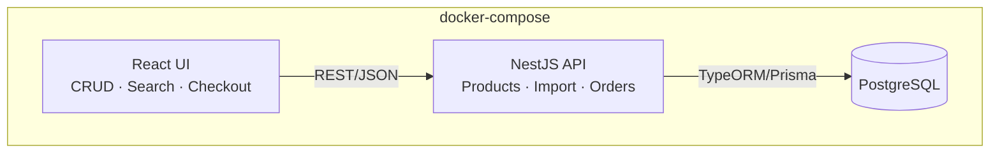
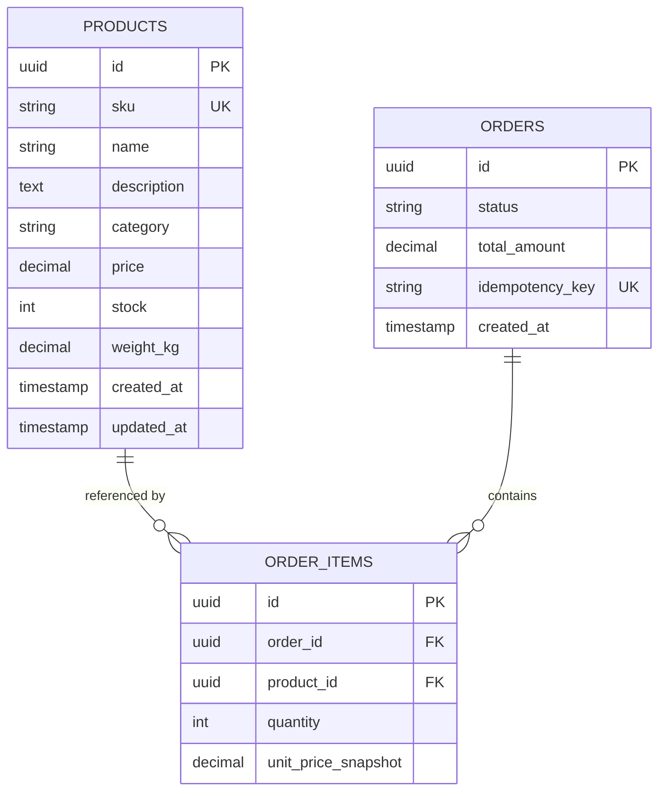
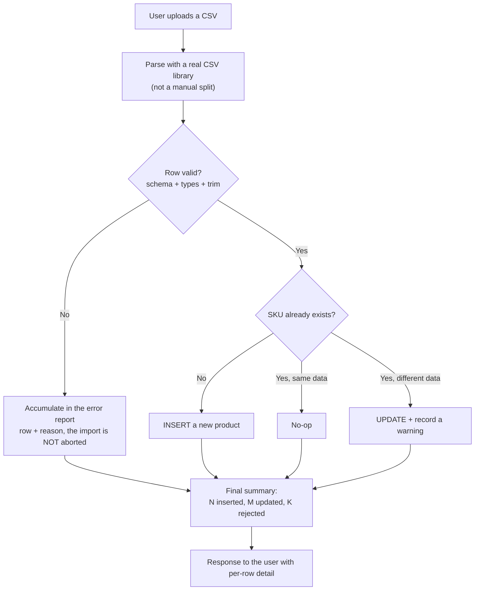
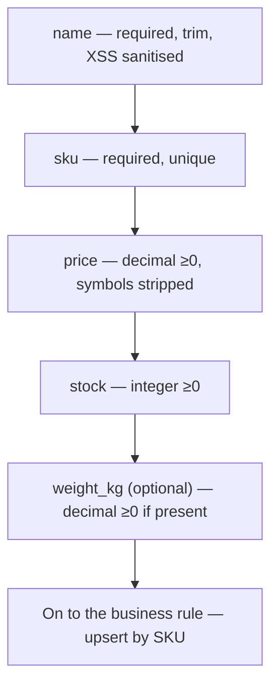
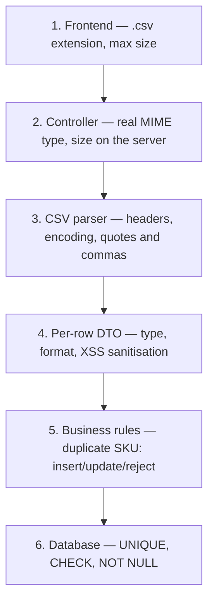
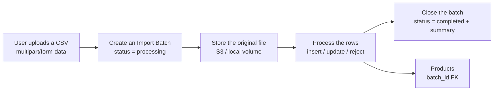
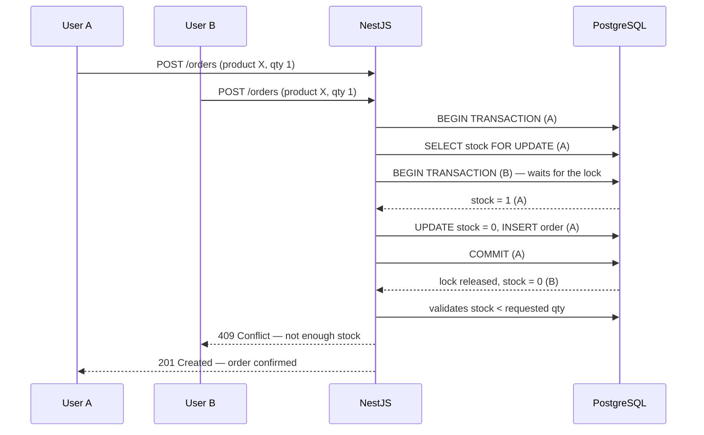

# LoanPro — Code Challenge E-Commerce | Open Spec

> A technical design document written before implementation. It is documented BEFORE writing code
> because the challenge asks for it explicitly: *"we want you to ask the right questions and guide
> AI with your experience and foreseeing skills"*.
>
> **Key context**: LoanPro is a lending company (fintech). Although the challenge is a toy
> e-commerce, it is treated with the mindset of a financial system: atomic transactions, race
> conditions on money and inventory prevented, traceability (auditing), and distrust by default of
> any input datum (the CSV includes XSS and SQL injection attempts — that is not a coincidence, it
> is part of the test).

**Sample CSV downloaded**: `2026-08-26` (the date of this analysis).

---

## Context for whoever picks this project up (Claude Code included)

This document is the result of a conversational design process carried out before writing code,
for a LoanPro take-home technical challenge. The goal is not only to pass the challenge's
checklist — it is to demonstrate senior architectural judgement by applying a fintech mindset to
an e-commerce domain.

**Already done:**

- A row-by-row analysis of the real sample CSV (`LoanPro_Code_Challenge_E-Commerce...csv`) — see
  section 1. It turned up formatting errors, blank rows, deliberate XSS/SQLi payloads, duplicate
  SKUs with conflicting data, and valid edge cases that must not be rejected.
- Architecture design (NestJS + React + PostgreSQL), the data model, the CSV import flow with
  layered validation (section 4.5), the stock concurrency strategy (section 5), and the design
  patterns to apply (section 6).
- Scope decisions: no authentication (a conscious decision, not an oversight), no real payment
  gateway, no optimistic locking — all justified in their sections.
- Project structure and frontend/infra stack decisions (section 10).

**Outstanding:**

- Analyse two existing candidate templates (`api`/BE and `web`/FE) to decide what is reused versus
  rewritten — the URLs of those repos had not been shared in this session yet.
- The actual implementation.

If you are Claude Code picking this up: **do not re-decide what is already here unless the user
explicitly asks**. This spec has already been through a round of "the right questions" with the
candidate. Your job is to implement against this document and to flag if something turns out not
to be technically viable when you get there — not to redesign from scratch.

---

## 0. Module index

| Layer | Module | Responsibility |
|---|---|---|
| BE | `products` | Product CRUD |
| BE | `catalog-import` | CSV import with validation |
| BE | `search` | Product search |
| BE | `orders` | Purchase, fake payment, stock control |
| BE | `common` | Global filters, validation pipes, sanitisation |
| FE | `products-admin` | CRUD screen |
| FE | `catalog-search` | Search |
| FE | `checkout` | Purchase flow |
| Infra | `docker-compose` | Local orchestration (3 containers) |

---

## 1. Real findings in the sample CSV

This is the most important section of the challenge — deciding what to do with these cases **is**
the interview. Below, each problematic row with its real line number in the file.

### 1.1 Format and type errors

| Line | Product | Problem | Proposed decision |
|---|---|---|---|
| 4 | Wireless Mouse | `price = "$29.99"` (currency symbol) | Sanitise: strip non-numeric symbols before parsing. If parsing fails → reject the row, do not assume. |
| 7 | Yoga Mat | `price = "free"` (text, not a number) | Reject the row. "free" is not a valid price — inventing 0.00 would silently alter the original datum. |
| 16 | Desk Lamp | `stock = -5` (negative) | Reject. Negative stock is not a valid business state (it is not the same as 0 = sold out). |
| 50 | Gaming Keyboard | `weight_kg` empty (trailing comma with no value) | Depends on the contract: if the field is required → reject; if optional → an explicit `NULL`, never `0` (0 kg is a false datum, not an absent one). |

### 1.2 Blank rows and invalid names

| Line | Problem | Decision |
|---|---|---|
| 25 | `name` empty | Reject — the name is the minimum business key. |
| 41 | `name` = whitespace only | Reject after `trim()`. A string of spaces passes a naive "not empty" check. |
| 62–63 | 100% blank row (`,,,,,,`) | Ignore silently (it does not count as an error, it is Excel/Sheets export noise), but if reported, log it at `debug` level. |

### 1.3 Security — this is deliberate in the dataset

| Line | Product | Problem | Decision |
|---|---|---|---|
| 20 | `<script>alert('xss')</script>` | XSS payload in `name` | **Reject the row**, reporting the invalid field (*decision updated 2026-08-27*: the initial version proposed sanitising, but storing the `alert('xss')` residue silently alters the original datum — inconsistent with the "free" price rule — and leaves rubbish that a consumer without escaping would treat as HTML). React's escaping on render remains the second layer of defence. |
| 29 | `Robert'); DROP TABLE products;--` | The classic Bobby Tables | With an ORM (TypeORM/Prisma) and *parameterised queries* this is already harmless by design — but it is documented explicitly in the README as proof that the import is safe against injection. **Never** build SQL by string concatenation, neither in the import nor in the search. |

### 1.4 Duplicates — the most interesting case to discuss in the interview

| Lines | SKU | Situation |
|---|---|---|
| 3 and 36 | `RS-001` | Same SKU, **different** price/description/stock (an "updated" product) |
| 11, 56 and 89 | `BS-021` | Line 89 is an **exact** duplicate of line 11. Line 56 has the same SKU but a different price and stock. |

**Decision and why** (*updated 2026-08-28 — TK-033*): the SKU is the natural business key, not the
name. Two **distinct situations** have to be separated, which the initial version of this spec
treated the same:

**1. The SKU repeats within the same file → all of its rows are REJECTED.**
Neither row has authority over the other: the file carries no date, version or origin that would
let one win. The initial version proposed "the last one wins" (a sequential upsert), and that was
dropped for two reasons:

- **It depended on order, not on data.** Sorting the CSV by name before uploading it — one click in
  Excel — changed the resulting catalog. The same file produced two different results.
- **It chose silently between contradictory financial data.** There is no business basis for
  claiming $94.99 is more correct than $89.99; "appears further down" is not a source of truth.

Industry precedent: PostgreSQL rejects exactly this case —
`ON CONFLICT DO UPDATE command cannot affect row a second time` — and the SQL standard's `MERGE`
raises a *cardinality violation*. The rule is not invented: it aligns with what the engine already
does. The implementation is in **two phases**: the whole file is validated (key uniqueness
included) and only then is anything written, so the result depends on the content and never on the
order.

If "the most recent wins" were wanted in future, the correct route is to **add an `updated_at`
column to the CSV contract**: that turns survival into a verifiable business rule rather than an
accident of position.

**2. The SKU already exists in the database → `UPSERT` (this does not change).**
Here the file does have authority: it is a catalog correction.

- Does not exist → `INSERT`.
- Exists with identical data → no-op (`unchanged`, avoids noise).
- Exists with different data → `UPDATE` + a warning in the report, not a fatal error.

**Impact on the sample CSV**: RS-001 (lines 2 and 36) and BS-021 (lines 11, 56 and 89) stay out of
the catalog with their reason in the report → 85 inserted, 10 rejected, 2 blank. Re-uploading the
same file gives `85 unchanged, 0 updated`: stable counters, the signal of a deterministic import.

### 1.5 Valid edge cases (not errors, but they must be tested)

| Line | Case | Why it matters |
|---|---|---|
| 47 | `price = 0.00` (Mystery Box) | Valid — a product can cost 0. Different from `"free"` (invalid text). |
| 51 | `stock = 0` (Vintage Clock) | Valid — "sold out", not an error. |
| 52 | `category` empty, `stock = 99999`, `weight_kg = 0` | An empty category → map to `"Uncategorized"` rather than reject (it is not a critical datum). High stock and weight 0 (a digital product) are legitimate. |
| 3, 5, 53 | Commas inside quoted fields | A real CSV parser (not `split(',')`) handles them fine. It is the proof that you must NOT do naive manual parsing. |
| 59 | Escaped quotes inside the name (`""Inside""`) | The same point — use a real CSV parsing library (`papaparse`, `csv-parse`), never a homemade regex. |
| 31, 36, 52 | Unicode (`™`, em dash `—`) | Encoding must be UTF-8 end to end (DB, API, front) or this gets corrupted. |

---

## 2. Overall architecture



**Why PostgreSQL and not Mongo**: the data is relational by nature (`products` ↔ `order_items` ↔
`orders`) and I need **referential integrity** and **ACID transactions** to guarantee that
"discount stock" + "create order" happen atomically. With Mongo I would have to simulate
multi-document transactions — possible today, but swimming against the current for an inherently
relational domain.

**Why NestJS**: I already run it in production (modular architecture, native DI, declarative
validation pipes with `class-validator`, guards, interceptors) — it fits exactly what a fintech
reviewer expects to see: a clear separation of responsibilities, not a single `index.js` holding
everything.

---

## 3. Data model



Key schema decisions:

- `price` and `weight_kg` are **`DECIMAL`**, never `FLOAT`. Money in binary floating point is a
  classic fintech bug (rounding errors). This applies even though the challenge is a toy.
- `sku` has a `UNIQUE` constraint at the database level, not only at application level — the real
  guarantee lives in the DB.
- `unit_price_snapshot` in `order_items`: the price is **frozen** at purchase time. If the product
  changes price afterwards, the historical order must not mutate — this is a basic principle of
  financial systems (immutability of past transactions).
- `idempotency_key` in `orders`: prevents duplicate purchases from a double click or a network
  retry (see the concurrency section).

---

## 4. CSV import flow



**Design decision — partial rather than all-or-nothing**: if one CSV row fails, the whole file is
**not** aborted. Everything valid is processed and a detailed report is returned (row, column,
rejection reason). Reason: in a real catalog import, a 500-product file with 3 broken rows should
not block the 497 good ones. All-or-nothing is documented as an alternative considered and why it
was dropped — it would be simpler, but less useful in production.

**Technical validation**: every row passes through a NestJS DTO with `class-validator`
(`@IsNotEmpty`, `@IsNumber`, `@Min(0)`, `@Transform` to strip `$` before parsing the price,
`@IsIn([...valid categories])` with a fallback to `"Uncategorized"`). The XSS sanitisation of
`name` happens here, before anything touches the database.

### Field-by-field validation (with the real cases from the CSV)

| Field | Type | Rule | Example that fails (CSV line) | Result |
|---|---|---|---|---|
| `name` | string | Required, not empty after `trim()`, **no HTML markup** (`<...>` pattern → rejection) | Line 25 (empty), line 41 (whitespace only), line 20 (`<script>...`) | Rejects the row, reporting the invalid field |
| `sku` | string | Required, unique — it is the business key | — (always present in the example) | Determines insert / update / no-op |
| `description` | string | Optional, sanitised against injection | Line 29 (`Robert'); DROP TABLE...`) | Sanitised; with a parameterised ORM it never executes as SQL |
| `category` | string/enum | Optional — if empty, falls back to `"Uncategorized"` | Line 52 (empty) | Does not reject, applies the default |
| `price` | decimal | Required, ≥0, strips currency symbols before parsing | Line 4 (`$29.99`), line 7 (`"free"`) | `$29.99` → cleaned and accepted. `"free"` → rejected (not parseable) |
| `stock` | int | Required, ≥0, integer | Line 16 (`-5`) | Rejected |
| `weight_kg` | decimal | Optional — if present, must be ≥0 | Line 50 (empty) | Stored as an explicit `NULL`, never `0` |

If any field fails its validation, the whole row is rejected at that point — it does not continue
down the chain — and the exact reason is recorded in the import batch's report (section 4.5).



---

## 4.5 Layered validation (defence in depth)

General rule: **every layer validates as if the previous ones did not exist**. Trusting that "it
was already validated upstream" is how bugs reach production — and in a fintech that costs real
money.

| Layer | What it validates | Concrete example | Tool |
|---|---|---|---|
| **1. Frontend (React)** | UX only — it is not security | `.csv` extension, max size (e.g. 5MB), preview before sending | HTML5 input validation + JS |
| **2. Controller (NestJS)** | The request itself | The file's real MIME type (not the extension), max size on the server | `FileInterceptor` + a custom pipe |
| **3. CSV parser** | The file's structure | Correct headers (7 expected columns), UTF-8 encoding, well-formed quotes and commas | `papaparse` / `csv-parse` — never a homemade regex |
| **4. Per-row DTO** | The type and format of each field | `price` decimal ≥0, `stock` integer ≥0, `name` not empty after `trim()`, XSS sanitised | `class-validator` + `@Transform` |
| **5. Business rules** | Domain logic | Duplicate SKU → insert, update or reject?, SKU repeated *within the same CSV* | The import service |
| **6. Database** | The last line of defence | `UNIQUE(sku)`, `CHECK(price >= 0)`, `NOT NULL` | PostgreSQL constraints |

Layer 1 is the only one that is **not** security — it exists so the user does not wait 10 seconds
to find out they uploaded an `.xlsx`. Everything else applies even when the frontend has already
"approved" the file.



### The full upload process (with versioning)

It is not just "parse and save products" — every import produces its own historical record.



Every import remains a queryable record — nothing is silently overwritten.

### Store versions of every upload? Yes — in a fintech it is close to mandatory

Without it, if somebody asks tomorrow *"why did this product's price change on Tuesday?"*, there is
no answer. That is unacceptable in a lending company where every datum must be traceable.

**Ideal level (real production)**

| Element | What it stores | What it is for |
|---|---|---|
| `import_batches` | Upload metadata: date, user, filename, status, counters | Auditing — "who imported what and when" |
| The original file stored | The raw CSV as it was uploaded (S3 or a volume) | Reprocess or audit the exact source datum |
| Per-row report | JSON detailing each row (accepted/rejected + reason) | Debugging — the user sees why their row 7 failed |
| `products.last_batch_id` | Which batch last touched the product | Traceability from product to the import that produced it |

**Minimum viable level for the challenge (limited time)**

The full "real production" level is not needed to demonstrate judgement — it is enough to implement
what is cheap and consciously document what is left out:

1. **Implement**: `import_batches` with status + counters + a JSON error report (cheap to build,
   and the part most noticed in the interview).
2. **Document as "future"** in the README: storing the raw file in blob storage and a field-by-field
   change log per product. It shows the thought was there without spending time that does not
   exist.

---

## 5. Concurrency — the point a fintech really will ask about

The real scenario: two users buy the **last product in stock** at the same time.



**Mechanism**: `SELECT ... FOR UPDATE` inside a transaction (a pessimistic lock) when reading stock
before discounting it. Alternative considered: **optimistic locking** (a `version` column +
`UPDATE ... WHERE version = X`, retrying on failure). Optimistic was dropped for this case because
expected contention is low (this is not a genuinely high-concurrency system) and a pessimistic lock
is simpler to reason about correctly in a take-home with limited time — documented as a conscious
trade-off, not as ignorance of the alternative.

**Idempotency**: the purchase endpoint accepts an `idempotency_key` (generated by the front when
the checkout starts). If the same key arrives twice (double click, network retry), the second call
returns the already-created order instead of creating a duplicate. This is exactly the pattern real
payment gateways use — worth mentioning because LoanPro processes money.

---

## 6. Design patterns applied (out of the box, not reinvented)

| Pattern | Where | Why |
|---|---|---|
| **Repository** | Data access through TypeORM/Prisma repositories | Decouples business logic from persistence — makes testing with mocks easier. |
| **DTO + validation pipe** | Every input endpoint | Nest brings it out of the box with `class-validator`. Rejects invalid requests before they reach the controller. |
| **Strategy** | A `PaymentProvider` interface with a `FakePaymentProvider` implementation | If Stripe or another provider is connected tomorrow, you implement the interface without touching the rest of `orders`. It is the correct way to "fake" a payment without leaving technical debt. |
| **Unit of Work (through a DB transaction)** | Order creation + stock discount | Both operations happen or neither does. |
| **Global Exception Filter** | `common/filters` | Every exception (validation, not found, stock conflict) returns a consistent error shape — no raw stack traces to the client. |
| **Light CQS** | Separating `search` (read) from `products` CRUD (write) | The search can be optimised differently (indexes, cache) without coupling to the transactional CRUD. |

---

## 7. Error handling — the response contract

Every API error follows a consistent shape (through the global Exception Filter):

```json
{
  "statusCode": 400,
  "error": "VALIDATION_ERROR",
  "message": "The price field must be a positive decimal number",
  "path": "/products",
  "timestamp": "2026-08-26T10:00:00Z"
}
```

For the CSV import specifically, the response includes per-row detail:

```json
{
  "summary": { "inserted": 88, "updated": 3, "rejected": 5 },
  "rejected": [
    { "row": 7, "reason": "price is not a valid number: 'free'" },
    { "row": 16, "reason": "stock must not be negative: -5" }
  ]
}
```

---

## 8. Security — summary

- Sanitisation of `name`/`description` against XSS at the input layer (not relying only on React's
  automatic escaping).
- An ORM with parameterised queries — zero concatenated SQL, zero risk from the line 29 payload.
- Strict type validation on every CSV field before touching the DB.
- CORS configured explicitly in NestJS (not `*` in an "enterprise-grade" context).
- Environment variables for DB credentials — never hardcoded, never in the repo.

---

## 9. What is NOT being implemented (and why it is documented this way)

- User authentication and authorisation — outside the challenge's explicit scope, mentioned as the
  "natural next step" in the README.
- A real payment gateway — the challenge explicitly asks to fake it.
- Optimistic locking for stock — the trade-off is documented in section 5.
- Advanced search pagination (cursor-based) — simple offset/limit pagination is implemented, enough
  for the sample dataset's volume; documented as something to revisit if the catalog grew to
  millions of rows.

> **Partial correction (TK-049, 2026-08-31).** Shipping was here as a single exclusion and turned
> out to be two different things. The order **does store the delivery address**: the checkout was
> asking for it and discarding it, so the detail could not show it and asking for it was theatre.
> What stays out is the **cost** of shipping — rates, carriers, taxes: the total derives
> exclusively from the purchased lines. Where it is delivered is stored, not what delivering it
> costs. There is no reusable address book either, because buying remains anonymous and there is no
> account to attach one to.

---

## 10. Project structure and stack decisions (frontend/infra)

### 10.1 Folder structure

```
loanpro-ecommerce-challenge/
├── docker-compose.yml       # the single compose orchestrating everything — api + web + db
├── README.md
├── docs/
│   └── OPEN_SPEC.md          # this document
├── .claude/
│   └── skills/               # see 10.7
├── api/                       # NestJS — analyse the existing template before deciding what to reuse
│   ├── src/
│   ├── Dockerfile
│   └── docker-compose.yml     # a candidate for removal if it competes with the root one
└── web/                       # React SPA — analyse the existing template
    ├── src/
    ├── Dockerfile
    └── ...
```

Rule: **a single `docker-compose.yml` at the root orchestrates everything**. If the `api` template
brings its own compose, which one wins is decided after reviewing the real content (pending URLs).

### 10.2 Authentication (*decision updated 2026-08-27 — TK-031*)

Initial version: no auth, leaving the extension point ready but unbuilt. **Decision in force**:
auth is built, but scoped to what actually justifies it. The trigger was concrete:
`POST /products/import` performs a bulk upsert of the catalog, and leaving that operation open to
the world does not hold up even in an exercise.

The boundary, deliberately:

- **Public**: catalog, search, detail and **the purchase**. A customer buys with no account, as in
  any real e-commerce. Closing the checkout would have solved a problem that does not exist.
- **Protected** (JWT): product creation and management, the CSV import and its history,
  infrastructure diagnostics and user administration.

Implementation: a global guard with an explicit opt-out (`@Public()`), so the system **fails
closed** — a new endpoint is born protected and forgetting to mark it public produces an obvious
401, rather than the silent failure of forgetting to protect it. No roles: any authenticated user
manages the catalog (initial.md does not ask for them and adding them would be invented scope).

The "half-mocked login" this section rejected is still avoided: the login is real against the API,
with a user seeded by migration (`demo@demo.com` / `demo`) documented in the README so the reviewer
gets in without friction.

### 10.3 Initial data (*decision updated 2026-08-27 — TK-030*)

Initial version: automatic seed of the CSV at boot. **Decision in force**: the app starts with an
**empty** catalog — all business data is created by the user interacting with the site (CRUD or CSV
import from the UI, which still exercises the real pipeline end to end). The only thing seeded is a
**demo user** (`demo@demo.com` / `demo`) through an idempotent data migration, so a login is
possible. The migrations do run by themselves at boot — zero manual steps.

### 10.4 Frontend — TanStack over Redux

| | TanStack Query | Redux (+Toolkit) |
|---|---|---|
| What it solves | Server state (fetch, cache, refetch, loading/error) | Arbitrary global client state |
| For this challenge | Products, search, checkout — it is all server state | There is no shared UI state to justify it |
| Boilerplate | Minimal | Actions/reducers/slices — overkill for 3 screens |

**Decision**: `@tanstack/react-query` for all fetching + routing with `react-router-dom` (or
`@tanstack/react-router` if the template already ships it mature — to be confirmed against the real
code). Redux is dropped as over-engineering for this challenge's scope.

### 10.5 FE ↔ BE communication locally

- `web` calls `api` through `VITE_API_URL` outside Docker — inside Docker, containers resolve each
  other by service name (`api`), not `localhost`.
- Explicit CORS in NestJS pointing at `web`'s origin, never `*`.

### 10.6 Additional security (complements section 8)

- `helmet` in NestJS — secure HTTP headers, one line of setup.
- Rate limiting (`@nestjs/throttler`) on the import endpoint — prevents abuse by uploading CSVs in
  a loop.

### 10.7 Claude Code skills to create

So that future code generation follows a consistent standard instead of improvising conventions
each time:

| Skill | What it documents |
|---|---|
| `nest-conventions` | Module structure, DTO naming, use of `class-validator`, the exception filter pattern |
| `react-component-standards` | Component folder structure, hook conventions, use of TanStack Query |
| `openspec-workflow` | How to reference this document when generating new code — every feature is validated against the spec before coding |

### 10.8 Outstanding before implementing

- [ ] Analyse the existing `api` template repo — Nest version, included ORM, module structure,
      Dockerfile.
- [ ] Analyse the existing `web` template repo — React version, included router, reusable
      components.
- [ ] Confirm which `docker-compose.yml` wins (root vs the one `api` ships).

---

## 11. How to run the project

```bash
docker-compose up --build
# Front:    http://localhost:3000
# API:      http://localhost:4000
# Postgres: localhost:5432
```

On startup, `api` runs migrations automatically (schema + the demo user `demo@demo.com` / `demo`).
The catalog starts empty: products are created from the UI (CRUD or CSV import).
