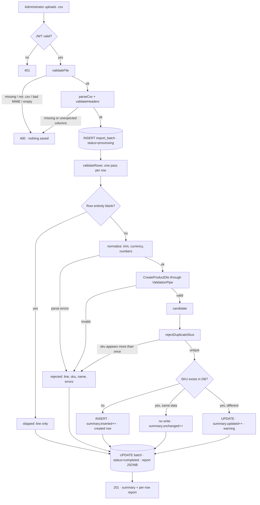

# P-01 · CSV import

| | |
|---|---|
| **Challenge requirement** | "Products can also be imported from a csv" |
| **Entry point** | `POST /api/v1/products/import` (multipart) |
| **Access** | Protected — requires a JWT |
| **Tickets** | TK-009, TK-023, TK-026, TK-033, TK-040, TK-041, TK-042, TK-047 |
| **Manual tests** | [TC-01](../testing/TC-01-initial-import.md), [TC-02](../testing/TC-02-upsert-existing-product.md), [TC-03](../testing/TC-03-unchanged-does-not-write.md) |

## Use case

An administrator uploads the supplier's CSV to load or refresh the catalog. The file is real-world
messy: bad prices, blank rows, duplicated SKUs, an XSS payload. The import must survive **any**
file, tell the administrator exactly what happened to every row, and never leave the catalog in a
half-applied state that nobody can reason about.

**The governing rule: a bad row never aborts the batch.** Failures at *file* level reject the whole
request; failures at *row* level are reported and the rest continues. That distinction is the
backbone of this process.

## Flow



## Files

### Backend

| Layer | File | Responsibility |
|---|---|---|
| Controller | [import.controller.ts](../../api/src/modules/import/import.controller.ts) | Route, `FileInterceptor` with a 5 MB cap, Swagger, `@CurrentUser()` for attribution |
| Service | [import.service.ts](../../api/src/modules/import/import.service.ts) | The whole process: file checks, parsing, per-row validation, duplicate rule, upsert, batch record |
| Normalizer | [import-row.normalizer.ts](../../api/src/modules/import/import-row.normalizer.ts) | Turns raw cells into typed values: trims, strips currency symbols, reports unparseable numbers |
| Contract | [import-result.interface.ts](../../api/src/modules/import/import-result.interface.ts) | Shape of the summary and the per-row report |
| Entity | [import-batch.entity.ts](../../api/src/modules/import/import-batch.entity.ts) | Audit record: filename, counters, `report` JSONB, who imported it |
| Row DTO | [create-product.dto.ts](../../api/src/modules/products/dto/create-product.dto.ts) | Every row is validated as if it were a `POST /products` body |
| Validator | [no-html.validator.ts](../../api/src/common/validators/no-html.validator.ts) | Rejects HTML markup instead of stripping it |
| Sanitizer | [sanitize.transformer.ts](../../api/src/common/transformers/sanitize.transformer.ts) | `trimText`; `escapeLikeWildcards` for batch search |

### Frontend

| Layer | File | Responsibility |
|---|---|---|
| View | [product-import-view.tsx](../../web/src/sections/product/view/product-import-view.tsx) | Dropzone, client-side `.csv` and size hints, triggers the upload |
| Hook | [use-product.ts](../../web/src/sections/product/hooks/use-product.ts) | `useImportProducts`; invalidates product lists and categories on success |
| Action | [product.ts](../../web/src/actions/product.ts) | `importProductsCsv` — multipart request |
| Mapper | [product.mapper.ts](../../web/src/actions/product.mapper.ts) | API report → view model |
| Summary | [import-summary.tsx](../../web/src/sections/product/components/import-summary.tsx) | Six outcome cards |
| Tables | [import-created-table.tsx](../../web/src/sections/product/components/import-created-table.tsx) · [import-issues-table.tsx](../../web/src/sections/product/components/import-issues-table.tsx) | Created rows and rows to review, each filterable |

## Validations

### File level — these reject the whole request

| Rule | Where | Failure |
|---|---|---|
| A file is present | `validateFile` | `400 file is required` |
| Extension is `.csv` | `validateFile` | `400 Only .csv files are allowed` |
| MIME is `text/csv`, `application/vnd.ms-excel` or `application/octet-stream` | `validateFile` | `400 Unsupported file type` |
| Body is not empty | `validateFile` | `400 CSV file is empty` |
| Size ≤ 5 MB | `FileInterceptor` limits | `413` |
| Parses as CSV | `parseCsv` | `400 Malformed CSV: …` |
| All 7 expected columns present | `validateHeaders` | `400 CSV is missing required columns: …` |
| No unexpected columns | `validateHeaders` | `400 CSV has unexpected columns: …` |

Expected headers: `name`, `sku`, `description`, `category`, `price`, `stock`, `weight_kg`.

> Unexpected columns are rejected rather than ignored. A file with an extra column is probably not
> the file the administrator thinks it is, and silently dropping data is worse than refusing it.

### Row level — these never abort the batch

| Rule | Where | Outcome |
|---|---|---|
| All cells blank | `validateRows` | **Skipped**, with its line recorded |
| `price` / `stock` / `weight_kg` parse as numbers | `ImportRowNormalizer` | **Rejected** with `field is not a valid number: '…'` |
| `sku` non-empty, ≤ 50 chars, `[A-Za-z0-9-]` only | `CreateProductDto` | **Rejected** |
| `name` non-empty, ≤ 255 chars | `CreateProductDto` | **Rejected** |
| `name` / `description` contain no HTML | `@NoHtml` | **Rejected** — the payload is reported verbatim, not sanitised |
| `price` ≥ 0, at most 2 decimals | `CreateProductDto` | **Rejected** |
| `stock` integer ≥ 0 | `CreateProductDto` | **Rejected** |
| `weight_kg` ≥ 0 when present | `CreateProductDto` | **Rejected** |
| `sku` appears at most once in the file | `rejectDuplicateSkus` | **Every** occurrence rejected |

### Normalisations applied before validation

| Input | Becomes | Why |
|---|---|---|
| `"  19.99  "` | `19.99` | Leading/trailing whitespace is a spreadsheet artefact |
| `"$29.99"` | `29.99` | Currency symbols are formatting, not data |
| `category` empty or absent | `"Uncategorized"` | A product without a category is still a product |
| `weight_kg` empty | `null` | Absent weight is unknown, not zero |
| `sku` / `name` cell blank | `""` | The cell existed and was empty — see [P-04](P-04-order-placement.md) on the same principle |

## The duplicate-SKU rule

A SKU is the business key. Repeating it inside one file makes the file ambiguous, and picking a
winner by row position would make the result depend on ordering rather than on data. So **every**
occurrence is rejected, and the message names all the lines involved and whether they carried
identical or conflicting data.

```
  duplicate sku in the file (lines 2, 36) with conflicting data
    — a sku must appear at most once per import
```

Implementation: [`rejectDuplicateSkus`](../../api/src/modules/import/import.service.ts).

## The five outcomes

Every data row lands in exactly one bucket, and they always add up:

```
  Total rows = Created + Updated + Unchanged + Rejected + Skipped empty
```

| Outcome | Meaning | Writes to DB? |
|---|---|---|
| **Created** | SKU did not exist | Yes, `INSERT` |
| **Updated** | SKU existed and at least one comparable field differed | Yes, `UPDATE` |
| **Unchanged** | SKU existed and all six comparable fields matched | **No** |
| **Rejected** | Failed format, a business rule, or the duplicate rule | No |
| **Skipped empty** | Every cell blank | No |

`Unchanged` writing nothing is deliberate and verifiable: `updatedAt` must not move. Comparison
lives in [`isIdentical`](../../api/src/modules/import/import.service.ts) over `name`,
`description`, `category`, `price`, `stock`, `weight_kg`.

## Failure modes

| Situation | Status | What the caller should do |
|---|---|---|
| No token | `401` | Sign in |
| Not a `.csv`, bad MIME, empty, malformed, wrong columns | `400` | Fix the file; nothing was saved |
| Over 5 MB | `413` | Split the file |
| Unexpected error mid-processing | `500` + batch marked `failed` | Check server logs; the batch record survives as evidence |
| Bad rows inside a valid file | `201` | Read the per-row report — this is **not** an error |

## Design decisions worth knowing

**In-memory only.** Multer uses memory storage: the upload is processed and discarded, never
written to disk. What persists is the domain data plus the `import_batches` audit record.

**The report is stored, not just returned.** `import_batches.report` is JSONB, so a batch can be
reopened later from **Product → Import history**. Fields added after the fact are optional in the
frontend types so older batches keep opening.

**Rejected rows carry the raw value from the file.** A row rejected because of its name shows
exactly what was wrong with it. React escapes it, so the XSS payload on line 20 of the sample
renders as text. See [P-02](P-02-product-crud.md) for why it is rejected rather than sanitised.

**Every row goes through the real `ValidationPipe`**, the same one that guards `POST /products` —
not a parallel set of checks that could drift from it.

## Verify it yourself

```bash
# 1. Header validation rejects the file whole
printf 'name,sku\nx,y\n' > /tmp/bad.csv
curl -s -X POST http://localhost:4000/api/v1/products/import \
  -H "Authorization: Bearer $TOKEN" -F 'file=@/tmp/bad.csv'
# expect 400 listing the missing columns

# 2. A valid import: counters must add up
curl -s -X POST http://localhost:4000/api/v1/products/import \
  -H "Authorization: Bearer $TOKEN" \
  -F 'file=@docs/csv/LoanPro Code Challenge E-Commerce.csv' | python -m json.tool | head -20
# expect totalRows 97 = 85 + 0 + 0 + 10 + 2

# 3. The duplicate rule rejected all occurrences, with names attached
docker exec ecommerce-db psql -U postgres -d ecommerce -c \
  "SELECT filename, total_rows, inserted, rejected, skipped_empty FROM import_batches ORDER BY \"createdAt\" DESC LIMIT 1;"
```

| Claim | Where to check |
|---|---|
| A bad row never aborts the batch | [`processRows`](../../api/src/modules/import/import.service.ts) — the per-row `try` collects and continues |
| Nothing is written to disk | [import.controller.ts](../../api/src/modules/import/import.controller.ts) — `FileInterceptor` with no `dest` |
| XSS is rejected, not stripped | [no-html.validator.ts](../../api/src/common/validators/no-html.validator.ts) and its test in `import.service.spec.ts` |
| Unchanged rows do not write | [TC-03](../testing/TC-03-unchanged-does-not-write.md) |
| Every rejected row carries `sku` and `name` | `openspec/specs/import-report-contract/spec.md` |

**Automated coverage:** `api/src/modules/import/import.service.spec.ts` (unit),
`import.integration.spec.ts` (the real 97-row sample), `import.hardening.spec.ts` (malformed
files), `import.attribution.spec.ts` (who imported it).
