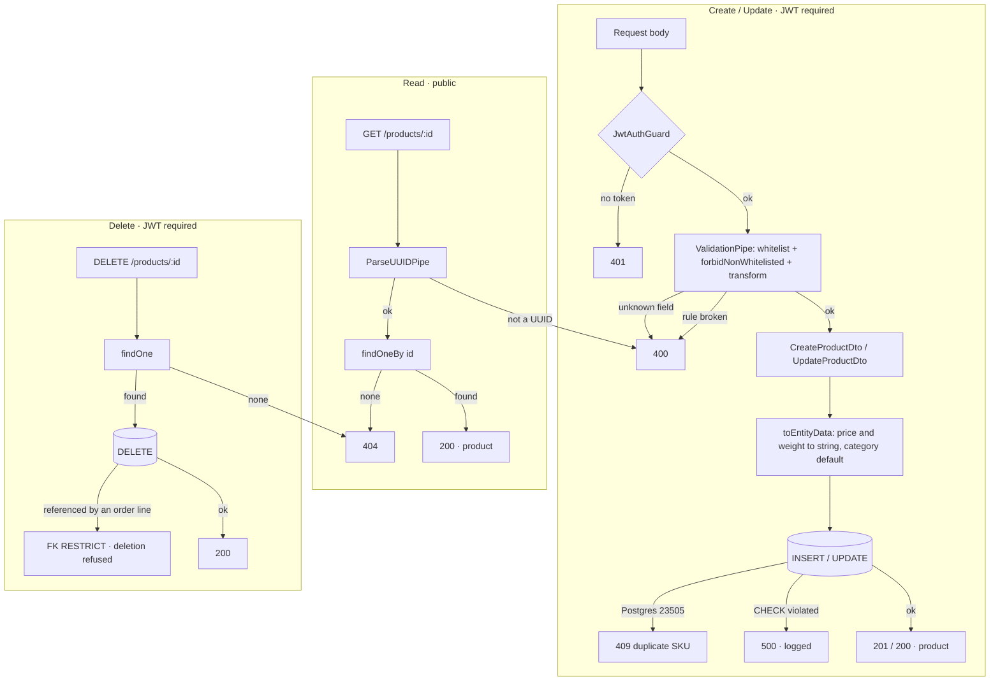

# P-02 · Product CRUD

| | |
|---|---|
| **Challenge requirement** | "CRUD for Products" + "UI is required for: CRUD for Products" |
| **Entry points** | `POST /products` · `GET /products/:id` · `PATCH /products/:id` · `DELETE /products/:id` |
| **Access** | Reads public · writes require a JWT |
| **Tickets** | TK-006, TK-007, TK-015 |

## Use case

An administrator maintains the catalog by hand: adds a product the supplier file did not carry,
corrects a price, adjusts stock, removes something discontinued. The same validation rules the CSV
import applies per row apply here — they are literally the same DTO, so the two entry points cannot
drift apart.

## Flow



## Files

### Backend

| Layer | File | Responsibility |
|---|---|---|
| Controller | [products.controller.ts](../../api/src/modules/products/products.controller.ts) | Routes, `@Public()` on reads, `ParseUUIDPipe`, Swagger with error codes |
| Service | [products.service.ts](../../api/src/modules/products/products.service.ts) | Business rules, decimal conversion, Postgres error translation |
| Entity | [product.entity.ts](../../api/src/modules/products/entities/product.entity.ts) | DB contract: `UNIQUE(sku)`, `CHECK(price >= 0)`, `CHECK(stock >= 0)`, `numeric` columns |
| Create DTO | [create-product.dto.ts](../../api/src/modules/products/dto/create-product.dto.ts) | Every field rule, with Swagger examples |
| Update DTO | [update-product.dto.ts](../../api/src/modules/products/dto/update-product.dto.ts) | `PartialType(CreateProductDto)` — same rules, all optional |
| Validator | [no-html.validator.ts](../../api/src/common/validators/no-html.validator.ts) | `@NoHtml` |
| Migration | [1787702400000-initial-schema.ts](../../api/src/database/migrations/1787702400000-initial-schema.ts) | The constraints, mirrored where they are actually enforced |

### Frontend

| Layer | File | Responsibility |
|---|---|---|
| Views | [product-create-view.tsx](../../web/src/sections/product/view/product-create-view.tsx) · [product-edit-view.tsx](../../web/src/sections/product/view/product-edit-view.tsx) · [product-details-view.tsx](../../web/src/sections/product/view/product-details-view.tsx) | Composition |
| Form | [product-new-edit-form.tsx](../../web/src/sections/product/product-new-edit-form.tsx) | Shared create/edit form |
| Schema | [product-schema.ts](../../web/src/sections/product/product-schema.ts) | Zod rules mirroring the DTO, for immediate feedback |
| Hooks | [use-product.ts](../../web/src/sections/product/hooks/use-product.ts) | `useCreateProduct`, `useUpdateProduct`, `useDeleteProduct`; cache invalidation |
| Actions | [product.ts](../../web/src/actions/product.ts) | Axios calls |
| Mapper | [product.mapper.ts](../../web/src/actions/product.mapper.ts) | `numeric` strings → numbers at the render edge |

## Validations

Identical to the per-row rules in [P-01](P-01-csv-import.md), because they are the same DTO.

| Field | Rules | Notes |
|---|---|---|
| `sku` | required · ≤ 50 · `^[A-Za-z0-9-]+$` · trimmed | Unique at DB level too |
| `name` | required · ≤ 255 · no HTML · trimmed | |
| `description` | optional · ≤ 2000 · no HTML · trimmed | |
| `category` | optional · ≤ 100 · trimmed | Empty becomes `Uncategorized` |
| `price` | required · ≥ 0 · ≤ 2 decimals | Stored `numeric(10,2)` |
| `stock` | required · integer · ≥ 0 | `CHECK (stock >= 0)` |
| `weightKg` | optional · ≥ 0 | Stored `numeric(10,3)`, `null` when absent |

**Unknown fields are rejected**, not ignored: the global pipe runs with `forbidNonWhitelisted`.
That is what makes `POST /orders` refuse a client-supplied `total` in [P-04](P-04-order-placement.md).

## Three decisions worth knowing

**XSS is rejected, not sanitised.** `@NoHtml` refuses any value containing `<…>` rather than
stripping tags. Stripping is a guess about intent and leaves the caller thinking their input was
accepted; refusing is unambiguous. React escaping is treated as a second line of defence, not the
first.

**Money never becomes a float.** `price` and `weightKg` are `numeric` in Postgres and typed as
`string` on the entity, so precision survives the round trip. `toEntityData` converts with
`price.toFixed(2)`; the frontend mapper converts to a number only at the point of rendering.

**SKU uniqueness lives in the database.** The service catches Postgres error `23505` and translates
it to `409`, but the guarantee is the `UNIQUE` constraint — an application-level check alone would
lose a race between two concurrent creates.

## Failure modes

| Situation | Status | What the caller should do |
|---|---|---|
| No token on a write | `401` | Sign in |
| Unknown field in the body | `400` | Remove it |
| A field rule is broken | `400` with the list of messages | Fix the input |
| `:id` is not a UUID | `400` | Check the id |
| Product not found | `404` | |
| SKU already exists | `409` | Use a different SKU, or update the existing product |
| Deleting a product that appears in an order | Refused by `RESTRICT` | An order is a historical record — see [P-04](P-04-order-placement.md) |

## Verify it yourself

```bash
TOKEN=$(curl -s -X POST http://localhost:4000/api/v1/auth/sign-in \
  -H 'Content-Type: application/json' \
  -d '{"email":"demo@demo.com","password":"demo"}' | python -c "import sys,json;print(json.load(sys.stdin)['accessToken'])")

# Writes need a token
curl -s -o /dev/null -w "no token: %{http_code}\n" -X POST http://localhost:4000/api/v1/products \
  -H 'Content-Type: application/json' -d '{"sku":"X-1","name":"X","price":1,"stock":1}'
# expect 401

# HTML in the name is refused, not stripped
curl -s -X POST http://localhost:4000/api/v1/products -H "Authorization: Bearer $TOKEN" \
  -H 'Content-Type: application/json' \
  -d '{"sku":"XSS-1","name":"<script>alert(1)</script>","price":1,"stock":1}'
# expect 400 "name contains invalid content: HTML markup is not allowed"

# Unknown fields are refused
curl -s -o /dev/null -w "unknown field: %{http_code}\n" -X POST http://localhost:4000/api/v1/products \
  -H "Authorization: Bearer $TOKEN" -H 'Content-Type: application/json' \
  -d '{"sku":"Y-1","name":"Y","price":1,"stock":1,"nope":true}'
# expect 400

# Duplicate SKU is a 409, decided by the database
curl -s -o /dev/null -w "first: %{http_code}\n" -X POST http://localhost:4000/api/v1/products \
  -H "Authorization: Bearer $TOKEN" -H 'Content-Type: application/json' \
  -d '{"sku":"DUP-1","name":"A","price":1,"stock":1}'
curl -s -o /dev/null -w "again: %{http_code}\n" -X POST http://localhost:4000/api/v1/products \
  -H "Authorization: Bearer $TOKEN" -H 'Content-Type: application/json' \
  -d '{"sku":"DUP-1","name":"B","price":1,"stock":1}'
# expect 201 then 409
```

| Claim | Where to check |
|---|---|
| Constraints exist in the database, not only in code | `docker exec ecommerce-db psql -U postgres -d ecommerce -c "\d products"` |
| Reads are public, writes are not | `@Public()` in [products.controller.ts](../../api/src/modules/products/products.controller.ts) |
| Decimals survive the round trip | `numeric` on the entity, `string` type, mapper converts at the edge |
| Create and import share their rules | Both use `CreateProductDto` |

**Automated coverage:** `products.service.spec.ts`, `products.controller.spec.ts`,
`route-protection.spec.ts` (which endpoints are public), `web/src/sections/product/product-schema.test.ts`.
