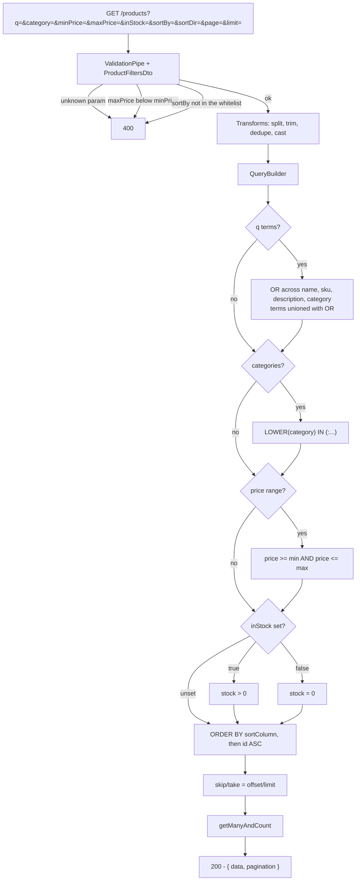

# P-03 · Search and filters

| | |
|---|---|
| **Challenge requirement** | "Search for Products" + "UI is required for: Search for Products" |
| **Entry point** | `GET /api/v1/products` |
| **Access** | Public |
| **Tickets** | TK-008, TK-024, TK-025, TK-026, TK-041, TK-046 |

## Use case

Two audiences share one endpoint. A shopper looks for something to buy; an administrator reviews
what an import actually loaded. The second is the demanding one — after importing 85 products you
need to answer "show me these five" without scrolling, which is why search takes **several terms at
once** and unions them.

## Flow



## Files

### Backend

| Layer | File | Responsibility |
|---|---|---|
| Controller | [products.controller.ts](../../api/src/modules/products/products.controller.ts) | `@Public()`, `@ApiQuery` per parameter |
| Filters DTO | [product-filters.dto.ts](../../api/src/modules/products/dto/product-filters.dto.ts) | Every parameter, its transform, its bound |
| Service | [products.service.ts](../../api/src/modules/products/products.service.ts) | `findAll` builds the query; `findCategories` aggregates |
| Cross-field validator | [is-not-less-than.validator.ts](../../api/src/common/validators/is-not-less-than.validator.ts) | `maxPrice >= minPrice` |
| Sanitizer | [sanitize.transformer.ts](../../api/src/common/transformers/sanitize.transformer.ts) | `escapeLikeWildcards` |
| Pagination | [pagination.helper.ts](../../api/src/common/pagination/pagination.helper.ts) · [pagination-response.builder.ts](../../api/src/common/pagination/pagination-response.builder.ts) | Parse in, shape out |
| Indexes | [1787961600000-product-search-indexes.ts](../../api/src/database/migrations/1787961600000-product-search-indexes.ts) · [1788048000000-product-price-index.ts](../../api/src/database/migrations/1788048000000-product-price-index.ts) | Support the filters |

### Frontend

| Layer | File | Responsibility |
|---|---|---|
| View | [product-list-view.tsx](../../web/src/sections/product/view/product-list-view.tsx) | Data grid, columns, server-side sort and pagination |
| Toolbar | [product-filters-toolbar.tsx](../../web/src/sections/product/components/product-filters-toolbar.tsx) | Search chips, category, price popover, availability, active-filter chips |
| URL state | [product-list-params.ts](../../web/src/sections/product/product-list-params.ts) | Parse/serialise the whole view state into the address |
| Hook | [use-product-list-params.ts](../../web/src/sections/product/hooks/use-product-list-params.ts) | Reads and navigates that state |
| Columns | [use-product-list-columns.ts](../../web/src/sections/product/hooks/use-product-list-columns.ts) | Widths and visibility persisted in localStorage |
| Shop view | [product-shop-view.tsx](../../web/src/sections/product/view/product-shop-view.tsx) | The public storefront listing |

## Parameters

| Parameter | Type | Rules | Default |
|---|---|---|---|
| `q` | repeated string | ≤ 10 terms, ≤ 100 chars each, trimmed, deduped | — |
| `category` | comma-separated | ≤ 20, trimmed, deduped, case-insensitive | — |
| `minPrice` | number | ≥ 0, ≤ 2 decimals | — |
| `maxPrice` | number | ≥ 0, ≤ 2 decimals, **≥ `minPrice`** | — |
| `inStock` | boolean | `true` \| `false`; omit for both | — |
| `sortBy` | enum | `name` `price` `stock` `createdAt` `updatedAt` | `createdAt` |
| `sortDir` | enum | `asc` \| `desc` | `desc` |
| `page` | numeric string | ≥ 1 | `1` |
| `limit` | numeric string | ≥ 1 | `10` (API) |

> The **frontend** default page size is 20 ([product-list-params.ts](../../web/src/sections/product/product-list-params.ts)); the API's own default when the parameter is absent is 10. The UI always sends an explicit `limit`.

## Four decisions worth knowing

**Several search terms are a union, not an intersection.** `?q=camping&q=speaker` returns products
matching *either*. The use case is "show me these products", not "rows satisfying all of them" —
which with free text would almost always be empty.

**Repeated parameter, not comma-separated.** `category` splits on commas, but `q` cannot: a free-text
search term may legitimately contain a comma. So `q` repeats (`?q=a&q=b`) while `category` splits.
The asymmetry is deliberate.

**Sorting is whitelisted and always total.** `sortBy` is validated against a fixed list mapped to
real columns — no user string ever reaches the SQL. Every query also appends `product.id ASC`, so
rows with equal sort values keep a stable order and pagination cannot show the same row twice or
skip one.

**LIKE wildcards are escaped.** A search for `50%` searches for the literal characters. Without
`escapeLikeWildcards`, `%` and `_` would silently become wildcards and return the wrong set.

## Sorting covers the whole catalog

Sorting happens in Postgres over the full result set, before pagination — not over the page in the
browser. With 87 products and a page size of 10, sorting by price ascending puts the cheapest
product in the catalog first, not the cheapest of the ten that happened to be visible. Columns the
server cannot sort are marked non-sortable in the grid rather than sorting incorrectly.

## The view survives navigation

The entire view state lives in the URL. Reloading, going back, or opening the link elsewhere
reproduces the same view. A parameter that equals its default is **omitted**, so a bare link means
"the current defaults" rather than a frozen snapshot.

Changing a filter resets to page 1 — otherwise you would land on page 5 of a result set with two
pages.

## Failure modes

| Situation | Status | Cause |
|---|---|---|
| `maxPrice` below `minPrice` | `400` | `@IsNotLessThan('minPrice')` |
| `sortBy` outside the whitelist | `400` | `@IsIn` |
| More than 10 terms or 20 categories | `400` | `@ArrayMaxSize` |
| A term longer than 100 chars | `400` | `@MaxLength({ each: true })` |
| Unknown query parameter | `400` | `forbidNonWhitelisted` |
| No match | `200` with `data: []` | Not an error |

## Verify it yourself

```bash
# Multi-term search is a union
curl -s "http://localhost:4000/api/v1/products?q=camping&q=speaker&limit=50" \
  | python -c "import sys,json;d=json.load(sys.stdin)['data'];print(len(d),'results');[print(' ',p['name']) for p in d[:6]]"

# Inverted price range is rejected
curl -s -o /dev/null -w "inverted range: %{http_code}\n" \
  "http://localhost:4000/api/v1/products?minPrice=50&maxPrice=10"

# Sort field is whitelisted
curl -s -o /dev/null -w "bad sort: %{http_code}\n" \
  "http://localhost:4000/api/v1/products?sortBy=password"

# Unknown parameter is rejected
curl -s -o /dev/null -w "unknown param: %{http_code}\n" \
  "http://localhost:4000/api/v1/products?evil=1"

# Wildcards are literal, not wildcards
curl -s "http://localhost:4000/api/v1/products?q=%25" \
  | python -c "import sys,json;print('results for literal percent:',json.load(sys.stdin)['pagination']['total'])"

# Sorting spans the catalog, not the page
curl -s "http://localhost:4000/api/v1/products?sortBy=price&sortDir=asc&limit=1" \
  | python -c "import sys,json;d=json.load(sys.stdin);print('cheapest:',d['data'][0]['price'],'of',d['pagination']['total'])"
```

| Claim | Where to check |
|---|---|
| No user string reaches the SQL | `SORT_COLUMNS` map in [products.service.ts](../../api/src/modules/products/products.service.ts); all values are bound parameters |
| Ordering is total | `.addOrderBy('product.id', 'ASC')` on every query |
| Indexes back the filters | `docker exec ecommerce-db psql -U postgres -d ecommerce -c "\d products"` |
| URL round-trips the state | `web/src/sections/product/product-list-params.test.ts` |

**Automated coverage:** `product-filters.dto.spec.ts` (validation and transforms),
`products.service.spec.ts` (query building), `products.controller.spec.ts`,
`web/src/sections/product/product-list-params.test.ts` (URL parse/serialise).
