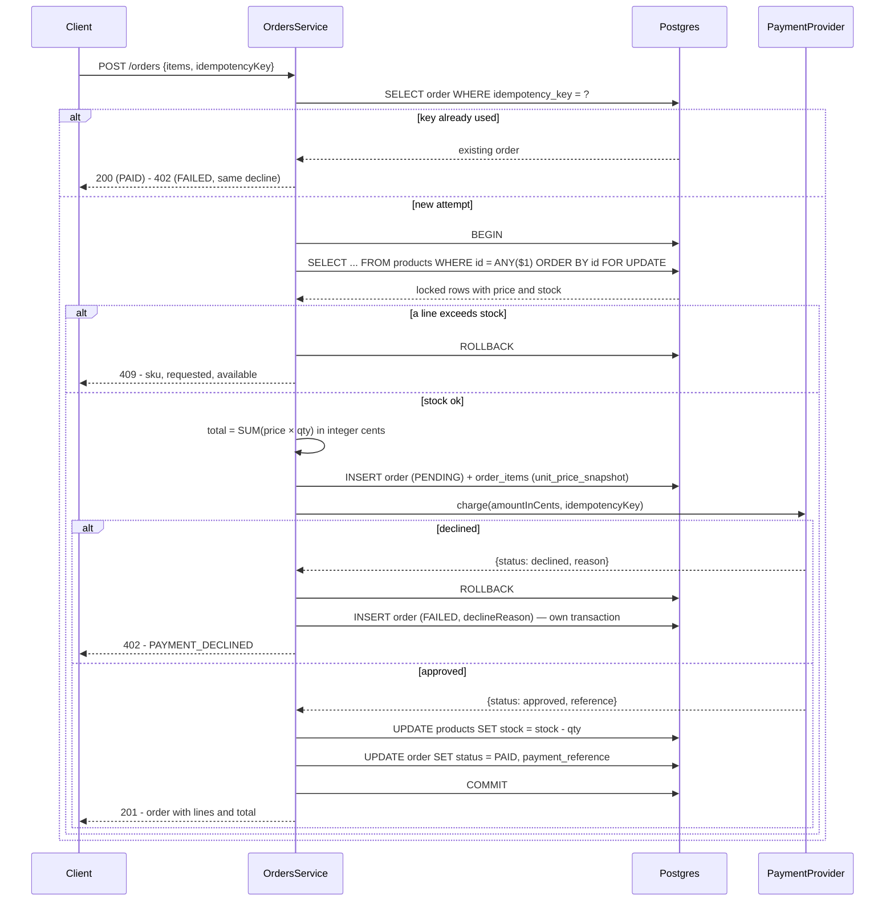

# P-04 · Order placement

| | |
|---|---|
| **Challenge requirement** | "Purchase products (payment provider not necessary, fake the payment)" + "UI is required for: Purchase for Products" |
| **Entry point** | `POST /api/v1/orders` |
| **Access** | **Public** — you buy without an account. Reading orders requires a JWT |
| **Tickets** | TK-010 |
| **Manual tests** | [TC-05](../testing/TC-05-purchase-flow.md) |

## Use case

A visitor fills a cart and buys. This is the only place in the system where money, shared mutable
state and concurrency meet at once, so it is built the most defensively: the catalog must never sell
a unit it does not have, the amount must never be something the browser could influence, and a
double click must not buy twice.

## Flow



## Files

### Backend

| Layer | File | Responsibility |
|---|---|---|
| Controller | [orders.controller.ts](../../api/src/modules/orders/orders.controller.ts) | `@Public()` on create, JWT on reads, 200-vs-201 on replay, Swagger error codes |
| Service | [orders.service.ts](../../api/src/modules/orders/orders.service.ts) | The whole transaction: locking, stock check, total, charge, idempotency, audit of declines |
| Entities | [order.entity.ts](../../api/src/modules/orders/entities/order.entity.ts) · [order-item.entity.ts](../../api/src/modules/orders/entities/order-item.entity.ts) | DB contract: `UNIQUE(idempotency_key)`, `numeric(12,2)`, FK `RESTRICT` to products |
| Status | [order-status.enum.ts](../../api/src/modules/orders/order-status.enum.ts) | `PENDING` `PAID` `FAILED` |
| DTOs | [create-order.dto.ts](../../api/src/modules/orders/dto/create-order.dto.ts) · [order-filters.dto.ts](../../api/src/modules/orders/dto/order-filters.dto.ts) | Wire contract — **no amounts** |
| Migration | [1788134400000-orders-and-order-items.ts](../../api/src/database/migrations/1788134400000-orders-and-order-items.ts) | Tables, unique constraint, checks, foreign keys |
| Payment | see [P-05](P-05-payment-processing.md) | The charge itself |

### Frontend

| Layer | File | Responsibility |
|---|---|---|
| Types | [purchase.ts](../../web/src/types/purchase.ts) | API contract and view model |
| Action | [purchase.ts](../../web/src/actions/purchase.ts) | `placePurchase`; translates 409/402 into distinguishable errors |
| Mapper | [purchase.mapper.ts](../../web/src/actions/purchase.mapper.ts) | `numeric` strings → numbers at the render edge |
| Hook | [use-purchase.ts](../../web/src/sections/purchase/hooks/use-purchase.ts) | Mutation; invalidates product caches so stock is not stale |
| Key | [idempotency-key.ts](../../web/src/sections/checkout/idempotency-key.ts) | Mint on entry, keep thereafter |
| Provider | [checkout-provider.tsx](../../web/src/sections/checkout/context/checkout-provider.tsx) | Cart state, the key, the confirmed order |
| Payment step | [checkout-payment.tsx](../../web/src/sections/checkout/checkout-payment.tsx) | Submits, disables while in flight, renders the three failure kinds |
| Confirmation | [checkout-order-complete.tsx](../../web/src/sections/checkout/checkout-order-complete.tsx) | Order id, lines, total |

## Validations

### Wire contract

| Field | Rules |
|---|---|
| `items` | array, non-empty, ≤ 100 entries |
| `items[].productId` | UUID |
| `items[].quantity` | integer ≥ 1 |
| `idempotencyKey` | string, 8–100 chars |
| **any amount** | **rejected** — `price` or `total` in the body produce a `400` |

That last row is enforced by the global pipe's `forbidNonWhitelisted`, not by special-case code.

### Business rules, inside the transaction

| Rule | Where | Failure |
|---|---|---|
| Every product exists | `lockProducts` | `404` |
| Stock covers each line | `assertStockAvailable` | `409` with `sku`, `requested`, `available` |
| The same product listed twice counts once | `mergeQuantitiesByProduct` | Otherwise each line would validate against full stock |
| The charge is approved | the provider | `402` |
| The key has not been used | `UNIQUE(idempotency_key)` | Returns the existing outcome |

## Five decisions worth knowing

### The charge runs inside the transaction

Not after it. Running it after would leave stock discounted against an order that was never paid,
requiring a compensating write to clean up. With a local, synchronous fake provider the transaction
is enough.

**Known limit, stated rather than hidden:** with a real gateway this stops being sufficient — a
`ROLLBACK` cannot undo a remote charge — and the answer becomes compensation or a saga with an
outbox. Out of scope, but named so it does not read as an oversight.

### Rows are locked ordered by `id`

[docs/initial.md](../initial.md) §5 chose pessimistic locking over optimistic, with the trade-off
documented. What §5 does not cover is **multiple lines per order**: two orders buying the same two
products in opposite sequence each hold what the other needs.

```
  Without ordering:                    With ORDER BY id:
  A locks P1, waits for P2             A locks P1, then P2
  B locks P2, waits for P1             B waits for P1, then proceeds
  -> deadlock                          -> serialised, both succeed
```

Correct per-line locking alone still deadlocks across lines. The ordering is the fix.

### The server owns the amount

The client sends `{ productId, quantity }`. The total is summed from the price on the **locked row**,
so it cannot change between the check and the charge. Any amount in the request is rejected outright.

The difference between a shopping cart and a system that handles money is whether the client can
influence the amount. Here it cannot.

### Money is summed in integer cents

Postgres returns `numeric` as a **string**. Converting it to a `number` to add it up is exactly where
binary floating point corrupts a total — `0.1 + 0.2 !== 0.3`. `toCents` / `fromCents` in
[orders.service.ts](../../api/src/modules/orders/orders.service.ts) sum as integers and format once
at the end.

`unit_price_snapshot` freezes the price per line: re-pricing a product later never mutates an order
already placed. Immutability of past transactions is basic financial-system behaviour.

### Idempotency inserts and catches, rather than checking first

Reading "does this key exist?" and then inserting is a race condition with a longer name: two
concurrent replays both read "no" and both insert. The `UNIQUE` constraint decides, and the code
catches Postgres error `23505` and returns the stored order.

The key is minted when the **checkout opens**, not when Confirm is pressed — a key generated on the
click would be a new key per click, which is precisely what it exists to prevent.

**One key, one outcome.** Replaying the key of a declined attempt declines again instead of charging
a second time. Retrying is therefore a *new* attempt with a *new* key, which the frontend mints on a
`402`.

## Failure modes

| Situation | Status | Retry worth it? | What the UI offers |
|---|---|---|---|
| Insufficient stock | `409` | No, not unchanged | The SKU, requested vs available, and a link back to the cart |
| Payment declined | `402` | **Yes** | "Nothing was charged, your cart is intact" |
| Product not found | `404` | No | Review the cart |
| Invalid quantity, missing key, amount sent | `400` | No | Fix the input |
| Key already used, order was paid | `200` | — | The existing order, not a second one |
| Network failure | — | Yes | Retrying with the same key is safe by design |

Separating `409` from `402` is the point: one of them is worth retrying and the other is not, and a
single generic error would hide which.

## States

```
                    charge approved
   [new] --> PENDING ---------------> PAID     (stock discounted, reference stored)
               |
               | charge declined
               v
            (rolled back) ---------> FAILED    (own transaction, no stock movement)
```

`PENDING` never persists on its own: it exists only inside the transaction. A `FAILED` row is
written afterwards, in its own transaction, because the one holding the order was rolled back. It
records the decline reason and touches no stock.

## Verify it yourself

```bash
ID=$(docker exec ecommerce-db psql -U postgres -d ecommerce -t -A -c "SELECT id FROM products WHERE stock > 5 LIMIT 1;")

# The client cannot set the amount
curl -s -o /dev/null -w "with total: %{http_code}\n" -X POST http://localhost:4000/api/v1/orders \
  -H 'Content-Type: application/json' \
  -d "{\"items\":[{\"productId\":\"$ID\",\"quantity\":1}],\"idempotencyKey\":\"probe-amount\",\"total\":\"0.01\"}"
# expect 400

# Same key twice: one order, one stock movement
for i in 1 2; do
  curl -s -o /dev/null -w "attempt $i: %{http_code}\n" -X POST http://localhost:4000/api/v1/orders \
    -H 'Content-Type: application/json' \
    -d "{\"items\":[{\"productId\":\"$ID\",\"quantity\":2}],\"idempotencyKey\":\"probe-idempotent\"}"
done
# expect 201 then 200

# Two buyers, one unit: exactly one wins
docker exec ecommerce-db psql -U postgres -d ecommerce -q -c "UPDATE products SET stock = 1 WHERE id = '$ID';"
curl -s -o /dev/null -w "A: %{http_code}\n" -X POST http://localhost:4000/api/v1/orders -H 'Content-Type: application/json' -d "{\"items\":[{\"productId\":\"$ID\",\"quantity\":1}],\"idempotencyKey\":\"probe-race-a\"}" &
curl -s -o /dev/null -w "B: %{http_code}\n" -X POST http://localhost:4000/api/v1/orders -H 'Content-Type: application/json' -d "{\"items\":[{\"productId\":\"$ID\",\"quantity\":1}],\"idempotencyKey\":\"probe-race-b\"}" &
wait
docker exec ecommerce-db psql -U postgres -d ecommerce -c "SELECT stock FROM products WHERE id = '$ID';"
# expect 201 + 409, and stock 0 — never -1
```

| Claim | Where to check |
|---|---|
| Locking is ordered by id | `lockProducts` in [orders.service.ts](../../api/src/modules/orders/orders.service.ts) |
| Totals are integer cents | `toCents` / `fromCents`, same file |
| Idempotency is constraint-driven | `isUniqueViolation` and the `UNIQUE` in the migration |
| A sold product cannot be deleted | FK `RESTRICT` in [order-item.entity.ts](../../api/src/modules/orders/entities/order-item.entity.ts) |
| The key is minted on entry | [idempotency-key.ts](../../web/src/sections/checkout/idempotency-key.ts) and its test |

**Automated coverage:** `orders.service.spec.ts` (15 unit tests) and
`orders.concurrency.spec.ts` (6 tests against a **real Postgres**, skipped when no database is
reachable). Locking and deadlock ordering are properties of the database, not of the service — a
mocked repository would assert that the code *calls* `FOR UPDATE`, never that it works.
