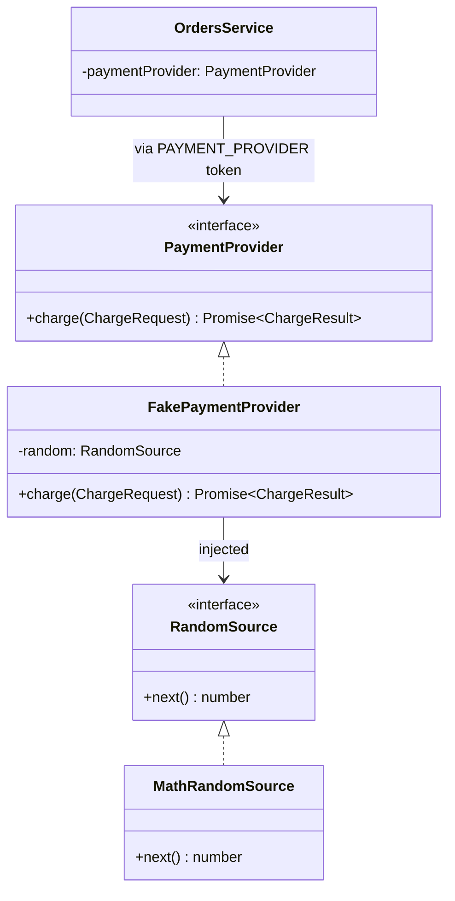
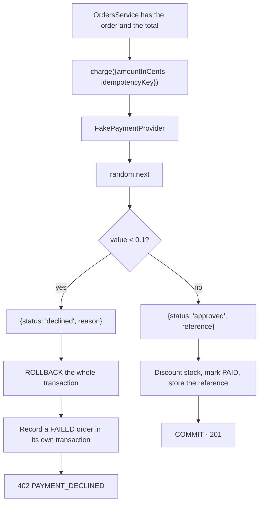

# P-05 · Payment processing

| | |
|---|---|
| **Challenge requirement** | "payment provider not necessary, fake the payment" |
| **Entry point** | None of its own — invoked inside the transaction of [P-04](P-04-order-placement.md) |
| **Access** | Internal |
| **Tickets** | TK-022 |
| **Manual tests** | [TC-05](../testing/TC-05-purchase-flow.md) check 6 |

## Use case

The challenge says to fake the payment. Faking it badly means an `if` in the middle of the order
service that always returns success — which leaves technical debt and proves nothing about how the
system behaves when a charge fails.

Faking it well means the *shape* is real: a provider behind an interface, a result that can be a
decline, and a decline that actually happens often enough to be observed. Swapping in a real
gateway should then be implementing one interface, not rewriting the purchase.

## The contract



`OrdersService` depends on the **token**, never on `FakePaymentProvider`. Connecting Stripe means
registering another class against `PAYMENT_PROVIDER`.

## Flow inside the purchase



## Files

| Layer | File | Responsibility |
|---|---|---|
| Contract | [payment.interface.ts](../../api/src/modules/payment/payment.interface.ts) | `PaymentProvider`, `ChargeRequest`, `ChargeResult`, the `PAYMENT_PROVIDER` token |
| Implementation | [fake-payment.provider.ts](../../api/src/modules/payment/fake-payment.provider.ts) | The ~10% decline rate |
| Randomness | [random-source.ts](../../api/src/modules/payment/random-source.ts) | `RandomSource` interface + `MathRandomSource` |
| Module | [payment.module.ts](../../api/src/modules/payment/payment.module.ts) | Binds both tokens, exports the provider |
| Consumer | [orders.service.ts](../../api/src/modules/orders/orders.service.ts) | Injects the token, resolves the result inside the transaction |
| UI | [checkout-payment.tsx](../../web/src/sections/checkout/checkout-payment.tsx) | Renders a decline as retryable, distinct from a stock conflict |

## Four decisions worth knowing

### A decline is a return value, not an exception

```ts
type ChargeResult =
  | { status: 'approved'; reference: string }
  | { status: 'declined'; reason: string }
```

A declined card is a legitimate outcome of a working system, not a failure of it. Modelling it as a
return value forces the caller to handle both branches; exceptions stay reserved for infrastructure
faults, where they belong.

> The union discriminates on a **string**, not a boolean. The api `tsconfig` has
> `strictNullChecks: false`, under which TypeScript will not narrow a union on boolean literals. A
> string discriminant narrows correctly regardless — and models the two outcomes better anyway.

### The provider declines ~10% on purpose

If it always approved, the rollback path would exist only in tests and no reviewer could see it. At
one in ten, a handful of purchases through the UI will hit it, and the catalog can be observed
coming back unchanged.

This is documented in the root `README.md` so it does not read as a bug.

### Randomness is injected, so tests never depend on luck

The obvious risk of a random decline is flaky tests. Calling `Math.random()` inside `charge` would
make the outcome unforcable.

Instead the provider takes a `RandomSource`. Production injects `MathRandomSource`; a test injects
one that returns a fixed value and decides the outcome exactly.

| Alternative | Why not |
|---|---|
| `Math.random()` inline | Flaky tests; the decline cannot be forced |
| Deterministic by amount | Reproducible, but the reviewer must know the trick |
| Always approve | The rollback cannot be triggered from the UI at all |

### A declined attempt still leaves a record

The transaction that held the order was rolled back, so the audit trail would have gone with it. A
`FAILED` order is therefore written in **its own transaction** afterwards, carrying the decline
reason and touching no stock.

That has a consequence worth stating: the failed attempt now holds the idempotency key, so replaying
that key declines again rather than charging twice — which is how real gateways behave. Retrying is
a *new* attempt with a *new* key, minted by the frontend on a `402`.

## Failure modes

| Situation | Result | Effect on the catalog |
|---|---|---|
| Charge approved | `201` · order `PAID` with a reference | Stock discounted |
| Charge declined | `402` · `PAYMENT_DECLINED` | **None** — rollback; a `FAILED` order records the attempt |
| Declined key replayed | `402` again, same reason | None |
| Provider throws | Propagates; the transaction rolls back | None |

## Verify it yourself

```bash
ID=$(docker exec ecommerce-db psql -U postgres -d ecommerce -t -A -c "SELECT id FROM products ORDER BY stock DESC LIMIT 1;")
BEFORE=$(docker exec ecommerce-db psql -U postgres -d ecommerce -t -A -c "SELECT stock FROM products WHERE id = '$ID';")

# 40 purchases: expect roughly 4 declines
for i in $(seq 1 40); do
  curl -s -o /dev/null -w "%{http_code} " -X POST http://localhost:4000/api/v1/orders \
    -H 'Content-Type: application/json' \
    -d "{\"items\":[{\"productId\":\"$ID\",\"quantity\":1}],\"idempotencyKey\":\"probe-decline-$i\"}"
done | tr ' ' '\n' | sort | uniq -c

AFTER=$(docker exec ecommerce-db psql -U postgres -d ecommerce -t -A -c "SELECT stock FROM products WHERE id = '$ID';")
PAID=$(docker exec ecommerce-db psql -U postgres -d ecommerce -t -A -c "SELECT count(*) FROM orders WHERE status='PAID' AND idempotency_key LIKE 'probe-decline-%';")
echo "stock $BEFORE -> $AFTER, paid orders: $PAID"
# The drop must equal the number of PAID orders: declines discounted nothing.

docker exec ecommerce-db psql -U postgres -d ecommerce -c \
  "SELECT status, total_amount, decline_reason FROM orders WHERE status='FAILED' ORDER BY \"createdAt\" DESC LIMIT 3;"
```

A run of this on 2026-08-29 produced **36 × `201` and 4 × `402`** — exactly 10% — with stock going
200 → 164, matching the 36 paid orders. The four declines discounted nothing and were recorded as
`FAILED`.

| Claim | Where to check |
|---|---|
| Orders depends on the token, not the class | Constructor of [orders.service.ts](../../api/src/modules/orders/orders.service.ts) |
| A decline is a value, not a throw | [payment.interface.ts](../../api/src/modules/payment/payment.interface.ts) |
| Randomness is injectable | [random-source.ts](../../api/src/modules/payment/random-source.ts) and `fake-payment.provider.spec.ts` |
| The decline rate really is ~10% | The distribution test sweeping a uniform source across 1000 charges |
| A decline leaves stock untouched | `orders.concurrency.spec.ts` — "rolls back the stock when the charge is declined" |

**Automated coverage:** `fake-payment.provider.spec.ts` (4 tests: approve, decline, determinism
under a fixed source, and the rate over a uniform sweep). The rollback itself is covered in
`orders.service.spec.ts` and `orders.concurrency.spec.ts`.
