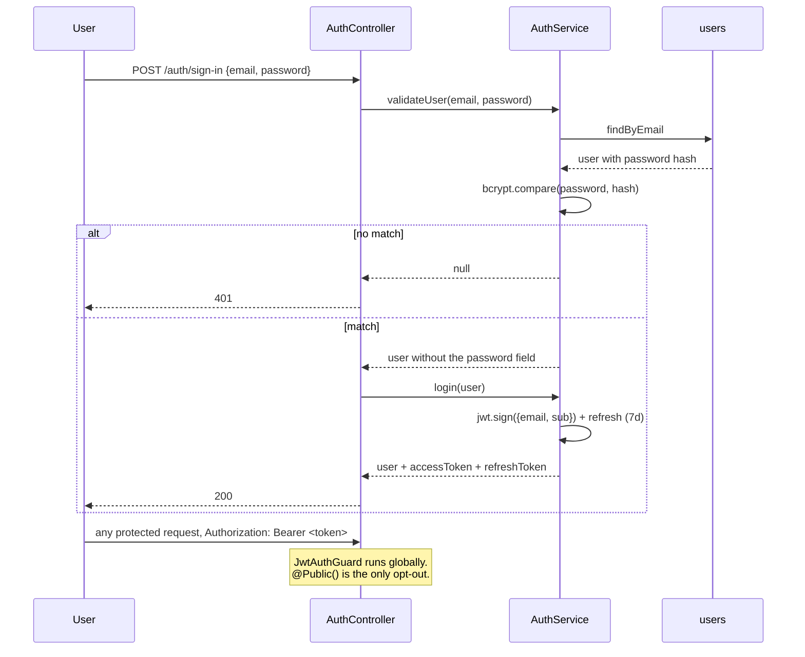

# P-06 · Authentication and the access boundary

| | |
|---|---|
| **Challenge requirement** | Not requested — added because leaving a bulk catalog upsert open to the world does not hold up |
| **Entry points** | `POST /auth/sign-in` · `POST /auth/sign-up` · `GET /auth/me` |
| **Access** | Sign-in and sign-up public; everything else protected by default |
| **Tickets** | TK-030, TK-031, TK-034 |
| **Decision record** | [docs/initial.md](../initial.md) §10.2 |

## Use case

The challenge does not ask for authentication, and the first design deliberately went without it.
What changed the decision was concrete: `POST /products/import` performs a **bulk upsert of the
entire catalog**, and leaving that open to anyone is indefensible even in an exercise.

So auth exists, scoped to exactly what justifies it. Buying stays public — a customer buys without
an account, like any real shop. Closing the checkout would have solved a problem that does not
exist.

## The boundary

```mermaid
flowchart LR
    subgraph Public [Public · no token]
        A1[GET /products]
        A2[GET /products/categories]
        A3[GET /products/:id]
        A4[POST /orders]
        A5[POST /auth/sign-in]
        A6[POST /auth/sign-up]
        A7[GET /health]
    end

    subgraph Protected [Protected · JWT required]
        B1[POST/PATCH/DELETE /products]
        B2[POST /products/import]
        B3[GET /products/import/batches]
        B4[GET /orders and /orders/:id]
        B5[GET /status/db and /status/redis]
        B6[/users/*]
        B7[GET /auth/me]
    end
```

The line: **browsing and buying are public; managing is not.** Reading orders is management, so it
sits on the protected side — the buyer gets their confirmation in the `POST` response instead.

## Flow



## Files

### Backend

| Layer | File | Responsibility |
|---|---|---|
| Guard | [jwt-auth.guard.ts](../../api/src/common/guards/jwt-auth.guard.ts) | Registered globally; checks `@Public()` before delegating to Passport |
| Decorator | [public.decorator.ts](../../api/src/common/decorators/public.decorator.ts) | Marks the opt-out |
| Decorator | [current-user.decorator.ts](../../api/src/common/decorators/current-user.decorator.ts) | Injects the authenticated user — used for import attribution |
| Controller | [auth.controller.ts](../../api/src/modules/auth/auth.controller.ts) | `sign-in`, `sign-up`, `me` |
| Service | [auth.service.ts](../../api/src/modules/auth/auth.service.ts) | `bcrypt.compare`, token signing, strips the password from the result |
| Module | [auth.module.ts](../../api/src/modules/auth/auth.module.ts) | JWT configuration |
| Users | [users.service.ts](../../api/src/modules/users/users.service.ts) | Lookup and password hashing |
| Composition | [app.module.ts](../../api/src/app.module.ts) | `{ provide: APP_GUARD, useClass: JwtAuthGuard }` |
| Seed | [1787788800000-demo-user.ts](../../api/src/database/migrations/1787788800000-demo-user.ts) | `demo@demo.com` / `demo`, idempotent |

### Frontend

| Layer | File | Responsibility |
|---|---|---|
| Guards | [web/src/auth/guard/](../../web/src/auth/guard/) | `AuthGuard` on the dashboard, `GuestGuard` on the auth pages |
| Routes | [dashboard.tsx](../../web/src/routes/sections/dashboard.tsx) · [auth.tsx](../../web/src/routes/sections/auth.tsx) | Where each guard applies |
| Axios | [axios.ts](../../web/src/lib/axios.ts) | Attaches the bearer token |

## The guard fails closed

Registered globally, with `@Public()` as the only opt-out. That direction matters:

| Approach | Forgetting to annotate produces |
|---|---|
| Guard per endpoint (fails **open**) | A silently unprotected endpoint — a security hole nobody notices |
| **Global guard + `@Public()`** (fails **closed**) | An obvious `401` on a new endpoint |

A new endpoint is born protected. The failure mode of forgetting is a visible error rather than a
silent exposure.

## Decisions worth knowing

**No roles.** Any authenticated user manages the catalog. `initial.md` does not ask for roles and
adding them would be inventing scope. The extension point is the guard.

**A real login, not a half-mocked one.** The earlier design rejected "a fake login screen wired to
nothing". The login authenticates against the API, with a user seeded by migration and documented in
the root `README.md` so a reviewer gets in without friction.

**Passwords are hashed with bcrypt** and the field is stripped from every response before it leaves
the service.

**The empty catalog is deliberate.** The app starts with no business data: everything is created by
the user through the UI, which exercises the real pipeline end to end. Only the demo user is seeded.

## Known gaps

Stated plainly rather than left to be discovered:

| Gap | Status |
|---|---|
| `CORS` is `origin: '*'` | Fine for a local exercise; [initial.md](../initial.md) §8 calls for an explicit origin in a real deployment. Tracked by TK-015 |
| The refresh token is issued but not exercised by a refresh flow | The access token is what the frontend uses |
| No rate limiting on `sign-in` | Out of scope; would matter in production |

## Failure modes

| Situation | Status |
|---|---|
| Wrong credentials | `401` |
| Missing or malformed token on a protected route | `401` |
| Expired token | `401` |
| Valid token, public route | Passes without a check |

## Verify it yourself

```bash
# Public: browsing and buying need no token
curl -s -o /dev/null -w "list products: %{http_code}\n" http://localhost:4000/api/v1/products
curl -s -o /dev/null -w "health:        %{http_code}\n" http://localhost:4000/api/v1/health

# Protected: managing does
curl -s -o /dev/null -w "list orders (anon):  %{http_code}\n" http://localhost:4000/api/v1/orders
curl -s -o /dev/null -w "import (anon):       %{http_code}\n" -X POST http://localhost:4000/api/v1/products/import
# expect 401 on both

TOKEN=$(curl -s -X POST http://localhost:4000/api/v1/auth/sign-in \
  -H 'Content-Type: application/json' \
  -d '{"email":"demo@demo.com","password":"demo"}' | python -c "import sys,json;print(json.load(sys.stdin)['accessToken'])")

curl -s -o /dev/null -w "list orders (auth):  %{http_code}\n" \
  -H "Authorization: Bearer $TOKEN" http://localhost:4000/api/v1/orders
# expect 200

# The password never leaves the service
curl -s -X POST http://localhost:4000/api/v1/auth/sign-in \
  -H 'Content-Type: application/json' \
  -d '{"email":"demo@demo.com","password":"demo"}' | grep -c '"password"'
# expect 0
```

| Claim | Where to check |
|---|---|
| The guard is global | `APP_GUARD` in [app.module.ts](../../api/src/app.module.ts) |
| `@Public()` is the only opt-out | `grep -rn "@Public()" api/src/modules` — 8 occurrences across auth, health, products and orders |
| Passwords are hashed | `bcrypt.compare` in [auth.service.ts](../../api/src/modules/auth/auth.service.ts) |
| Imports record who ran them | `@CurrentUser()` in [import.controller.ts](../../api/src/modules/import/import.controller.ts) |

**Automated coverage:** `route-protection.spec.ts` (which endpoints are public and which are not),
`jwt-auth.guard.spec.ts`, `import.attribution.spec.ts`.
