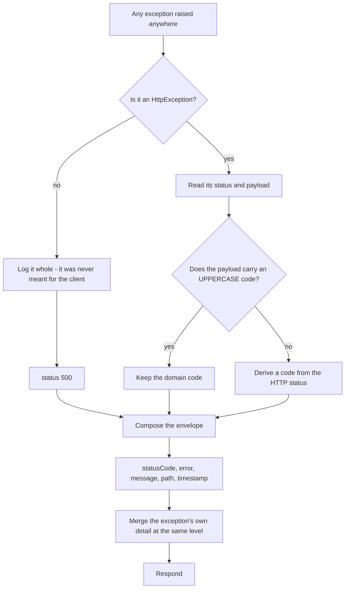

# P-07 · Error contract

| | |
|---|---|
| **Challenge requirement** | Not requested directly — `docs/initial.md` §7 promised it and the code did not deliver it |
| **Entry point** | Every endpoint. The filter runs on all of them |
| **Access** | Internal |
| **Tickets** | TK-014 |

## Use case

A client needs to tell one failure from another to know what to do next: fix the cart, retry the
charge, correct the input, or give up. That is only possible if every error answers in the same
shape and carries a code that means the same thing every time.

Before this, the API answered with at least four different shapes and none of them carried `path`
or `timestamp`. `docs/initial.md` §7 had specified the contract; nothing enforced it.

## Flow



## The envelope

Every error, without exception:

```json
{
  "statusCode": 409,
  "error": "INSUFFICIENT_STOCK",
  "message": "Not enough stock for RS-001: 99 requested, 2 left",
  "path": "/api/v1/orders",
  "timestamp": "2026-08-29T10:58:31.593Z",
  "sku": "RS-001",
  "requested": 99,
  "available": 2
}
```

The last three keys are error-specific detail. The filter normalises the **envelope**; it does not
flatten the content, because the checkout reads those fields to tell the customer which line fell
short.

## Files

| Layer | File | Responsibility |
|---|---|---|
| Filter | [http-exception.filter.ts](../../api/src/common/filters/http-exception.filter.ts) | Catches everything, composes the envelope, preserves detail, logs the unexpected |
| Codes | [error-codes.ts](../../api/src/common/filters/error-codes.ts) | The single catalogue, plus the status → code fallback |
| DB translator | [database-error.translator.ts](../../api/src/common/filters/database-error.translator.ts) | Postgres codes → HTTP, in one place for the whole system |
| Registration | [main.ts](../../api/src/main.ts) | `useGlobalFilters`, next to the global `ValidationPipe` |
| Consumer | [purchase.ts](../../web/src/actions/purchase.ts) | Branches on the status and reads the conflict detail |

## The code catalogue

| Code | Status | When |
|---|---|---|
| `VALIDATION_ERROR` | `400` | A DTO rule failed, or an unknown field was sent |
| `UNAUTHORIZED` | `401` | Missing, malformed or expired token |
| `FORBIDDEN` | `403` | Authenticated but not allowed |
| `NOT_FOUND` | `404` | The resource does not exist |
| `PAYMENT_DECLINED` | `402` | The provider declined the charge |
| `INSUFFICIENT_STOCK` | `409` | A line exceeds the stock on hand |
| `DUPLICATE_RESOURCE` | `409` | A unique key already exists |
| `RESOURCE_IN_USE` | `409` | Referenced by other records and cannot be removed |
| `PAYLOAD_TOO_LARGE` | `413` | Upload over the limit |
| `UNSUPPORTED_MEDIA_TYPE` | `415` | Wrong content type |
| `INTERNAL_ERROR` | `500` | Anything unforeseen |

`error` is a **code**, not the HTTP status spelled out. Nest fills it with `"Not Found"` by
default, which duplicates `statusCode` and is useless to branch on.

## Database errors

`handleDBExceptions` used to be copied into `products.service.ts` and `users.service.ts`, which is
how the same Postgres code ended up meaning two different things:

| Postgres | `products` before | `users` before | Now |
|---|---|---|---|
| `23505` unique violation | `409` | **`400`** | `409 DUPLICATE_RESOURCE` |
| `23503` foreign key violation | *(unhandled → 500)* | *(unhandled → 500)* | `409 RESOURCE_IN_USE` |
| anything else | `500` | `500` | `500`, detail only in the log |

`409` is right for `23505`: the request is well formed and the conflict is with the current state
of the resource. `400` claimed the caller had written the request wrong, which was not true.

`23503` is not hypothetical here — the `RESTRICT` foreign key on `order_items` refuses to delete a
product that was sold, and that correct refusal used to surface as an internal error.

## Nothing internal leaks

A `500` answers with a generic message; the real error goes to the log. `users.service.ts` used to
return Postgres `error.detail` straight to the client, which names columns and values. Same
reasoning as §8 not returning stack traces.

## Verify it yourself

```bash
# Every status carries the same five fields
for path in "products/00000000-0000-4000-8000-000000000000" "products?sortBy=nope" "orders"; do
  curl -s "http://localhost:4000/api/v1/$path" | python -m json.tool | head -8; echo
done
```

Run against the stack on 2026-08-29:

```
404  {"statusCode":404,"error":"NOT_FOUND","message":"...","path":"/api/v1/products/000...","timestamp":"..."}
400  {"statusCode":400,"error":"VALIDATION_ERROR","message":["maxPrice must not be less than minPrice", ...],"path":"...","timestamp":"..."}
401  {"statusCode":401,"error":"UNAUTHORIZED","message":"Unauthorized","path":"/api/v1/orders","timestamp":"..."}
409  {"statusCode":409,"error":"INSUFFICIENT_STOCK", ..., "sku":"CONTRACT-1","requested":99,"available":2}
409  {"statusCode":409,"error":"DUPLICATE_RESOURCE","message":"Product with sku 'CONTRACT-1' already exists", ...}
409  {"statusCode":409,"error":"RESOURCE_IN_USE","message":"Product is referenced by other records and cannot be removed", ...}
```

That last one used to be a `500`.

| Claim | Where to check |
|---|---|
| The filter runs on everything | `useGlobalFilters` in [main.ts](../../api/src/main.ts) |
| Detail survives normalisation | `extractDetail` in the filter, and its test |
| One translation for the whole system | No `handleDBExceptions` remains: `grep -rn handleDBExceptions api/src` |
| A 500 never leaks detail | `database-error.translator.spec.ts` — "never returns the Postgres detail to the client" |

**Automated coverage:** `http-exception.filter.spec.ts` (14 tests: envelope per status, code
resolution, detail preservation, no leakage, logging) and `database-error.translator.spec.ts`
(10 tests). The foreign-key case is verified against a **real database** in
`orders.concurrency.spec.ts` — "refuses to delete a product that appears in an order".
