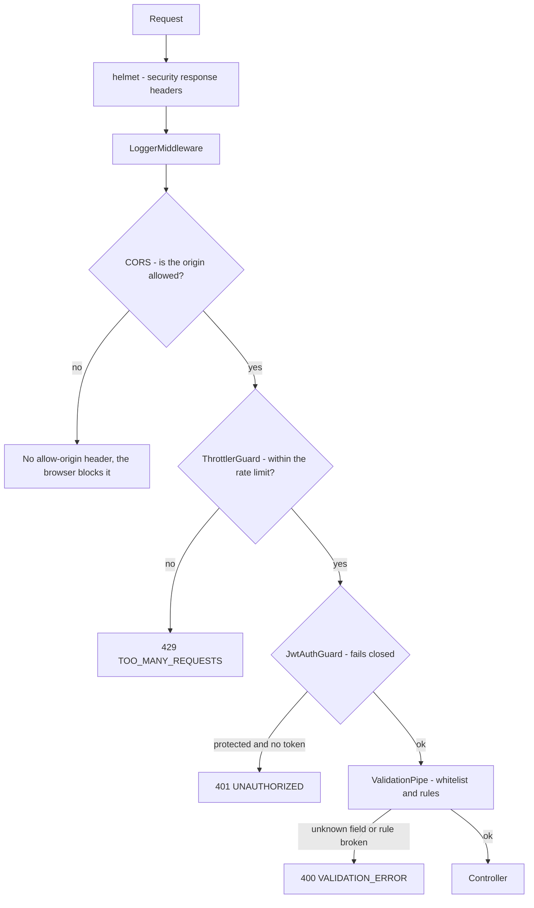

# P-08 · Security hardening

| | |
|---|---|
| **Challenge requirement** | Not requested directly — `docs/initial.md` §8 and §10.6 set the bar |
| **Entry point** | Every request, before it reaches a controller |
| **Access** | Internal |
| **Tickets** | TK-015 |

## Use case

The word in the brief is *enterprise-grade*. A reviewer who opens the network tab and sees
`Access-Control-Allow-Origin: *`, no security headers, and an unmetered bulk-upsert endpoint learns
something about the project regardless of how good the domain code is.

This process covers the defences that apply to **every** request rather than to one flow.

## The layers a request crosses



## Files

| Concern | File | What it does |
|---|---|---|
| Headers, CORS | [main.ts](../../api/src/main.ts) | `helmet()` and `enableCors` with an explicit origin list |
| Origins | [app.configuration.ts](../../api/src/config/app.configuration.ts) | Parses `CORS_ORIGINS`, defaulting to the web container |
| Rate limiting | [app.module.ts](../../api/src/app.module.ts) | `ThrottlerModule` plus the guard registered globally |
| Import limit | [import.controller.ts](../../api/src/modules/import/import.controller.ts) | `@Throttle` — 5 per minute |
| Input rejection | [no-html.validator.ts](../../api/src/common/validators/no-html.validator.ts) | `@NoHtml` on `name` and `description` |
| Auth boundary | see [P-06](P-06-authentication.md) | Fail-closed guard with `@Public()` opt-out |

## The measures

### CORS names the origin

`origin: '*'` is replaced by an explicit list, read from `CORS_ORIGINS` and defaulting to
`http://localhost:3000` — the web container. A test asserts the resolved value **never contains a
wildcard**, so the old behaviour cannot come back by accident.

```
  Origin: http://localhost:3000  ->  Access-Control-Allow-Origin: http://localhost:3000
  Origin: https://evil.test      ->  (no header at all)
```

### Security headers via helmet

`Strict-Transport-Security`, `X-Content-Type-Options: nosniff`, `X-Frame-Options: SAMEORIGIN`,
`Referrer-Policy: no-referrer`, `X-DNS-Prefetch-Control: off`, and `X-Powered-By` removed.

The Content Security Policy is **switched off deliberately**: Swagger serves its own inline scripts
and styles, and the default CSP breaks the docs page. Turning off one header to keep the API
documentation working is a defensible trade in an exercise; in a real deployment the docs would be
served separately and the CSP would stay on. Stated here rather than left as a silent gap.

### Rate limiting where it earns its place

| Route | Limit | Why |
|---|---|---|
| `POST /products/import` | **5 / min** | A bulk upsert of the whole catalog — the most expensive thing the API exposes. Generous for a person, useless for a script |
| Everything else | 300 / min | A loose ceiling, not a real limit |

The default is deliberately loose because a tight one would throttle the app itself: the status
page alone polls three endpoints every five seconds, which is 36 requests a minute before anyone
browses anything. A limit that breaks normal use gets removed by the next developer, which is worse
than no limit.

A `429` answers with the same envelope as every other error ([P-07](P-07-error-contract.md)):

```json
{ "statusCode": 429, "error": "TOO_MANY_REQUESTS", "message": "...", "path": "...", "timestamp": "..." }
```

> That code was added *because* of this work: the first run returned `INTERNAL_ERROR` for a `429`,
> since the status was not in the catalogue. Adding a new status is exactly how gaps in a mapping
> surface.

### HTML is rejected, not sanitised

`@NoHtml` on `name` and `description` refuses any value containing `<…>`. It sits on
`CreateProductDto`, which the CSV import validates **every row** against, so the same rule covers
manual creation and bulk import — they cannot drift apart.

Rejecting rather than stripping is the deliberate choice: stripping guesses at intent and leaves
the caller believing their input was accepted. The sample file's line 20 carries
`<script>alert('xss')</script>` and it is reported back verbatim as the reason for rejection, where
React escapes it.

React's escaping is treated as a second line of defence, never the first.

### Everything else already in place

| Measure | Where |
|---|---|
| Parameterised queries, no string-concatenated SQL | TypeORM query builder throughout |
| `LIKE` wildcards escaped | `escapeLikeWildcards` — see [P-03](P-03-product-search.md) |
| Unknown fields rejected | `forbidNonWhitelisted` on the global pipe |
| Credentials from environment | [app.configuration.ts](../../api/src/config/app.configuration.ts) — the only place reading `process.env` |
| Uploads never touch disk | Multer memory storage — see [P-01](P-01-csv-import.md) |
| Internal detail never returned | See [P-07](P-07-error-contract.md) |

## Known gaps

| Gap | Status |
|---|---|
| CSP disabled | Traded for working Swagger docs, as explained above |
| No rate limit on `sign-in` | Would matter in production; the challenge has one seeded user |
| No refresh-token rotation | A refresh token is issued but there is no refresh flow |
| No secret management | Secrets come from environment variables, which is right for this scope but not a vault |
| Rate limiting is per-instance, in memory | Multiple API replicas would each keep their own count; a shared store would be needed |

## Verify it yourself

```bash
# Security headers, and X-Powered-By gone
curl -s -D - -o /dev/null http://localhost:4000/api/v1/health | grep -iE "x-frame|x-content-type|strict-transport|referrer|x-powered"

# CORS answers the allowed origin and ignores anything else
curl -s -D - -o /dev/null -H "Origin: http://localhost:3000" http://localhost:4000/api/v1/products | grep -i access-control-allow-origin
curl -s -D - -o /dev/null -H "Origin: https://evil.test"    http://localhost:4000/api/v1/products | grep -ci access-control-allow-origin

# The import is capped at five per minute
TOKEN=$(curl -s -X POST http://localhost:4000/api/v1/auth/sign-in -H 'Content-Type: application/json' \
  -d '{"email":"demo@demo.com","password":"demo"}' | python -c "import sys,json;print(json.load(sys.stdin)['accessToken'])")
printf 'name,sku,description,category,price,stock,weight_kg\nA,RL-001,d,Test,1.00,1,0.1\n' > /tmp/rl.csv
for i in $(seq 1 7); do
  curl -s -o /dev/null -w "$i: %{http_code}  " -X POST http://localhost:4000/api/v1/products/import \
    -H "Authorization: Bearer $TOKEN" -F 'file=@/tmp/rl.csv'
done; echo

# Browsing is not limited
for i in $(seq 1 12); do curl -s -o /dev/null -w "%{http_code} " http://localhost:4000/api/v1/products; done; echo
```

Run against the stack on 2026-08-29:

```
headers   Referrer-Policy, Strict-Transport-Security, X-Content-Type-Options,
          X-DNS-Prefetch-Control, X-Download-Options, X-Frame-Options   (no X-Powered-By)
CORS      allowed origin -> echoed;  foreign origin -> 0 headers
import    1: 201  2: 201  3: 201  4: 201  5: 201  6: 429  7: 429
browsing  200 x12
```

| Claim | Where to check |
|---|---|
| CORS can never be a wildcard | `security.spec.ts` — "never resolves to a wildcard" |
| The import carries the strict limit | `security.spec.ts` — reads the `@Throttle` metadata |
| Browsing stays on the loose default | Same suite, asserts no per-route limit on `findAll` |
| HTML is rejected in bulk import too | `import.service.spec.ts` — "rejects an XSS payload in the name instead of sanitizing it" |

**Automated coverage:** `security.spec.ts` (6 tests). The header and rate-limit behaviour itself is
verified against the running stack, above — asserting that helmet sets its own headers would be
testing the library.
