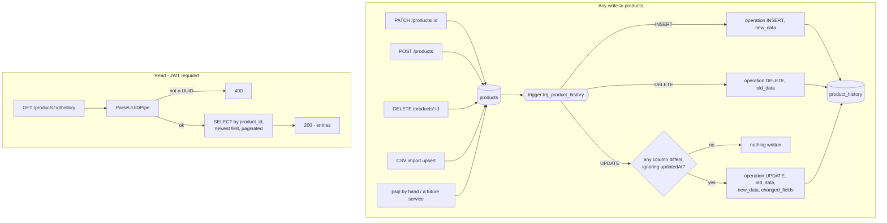

# P-11 · Product change history

| | |
|---|---|
| **Challenge requirement** | Not asked for — added after a review question: "should we keep a history of what happens to each product?" |
| **Entry points** | `GET /products/:id/history` · every write to the `products` table |
| **Access** | The endpoint requires a JWT · the recording is unconditional |
| **Tickets** | TK-058 |

## Use case

A price is wrong in the shop and nobody remembers changing it. A product vanished from the catalog
and the question is when, and whether it was a CSV import or somebody clicking. The history answers
both from the product's own detail page: what changed, from what to what, and when.

It is also the reason retiring a product is safe. `discontinued_at` records the current state;
the history records how it got there, including the times it went back on sale.

## Flow



## Files

| Layer | File | Responsibility |
|---|---|---|
| Migration | [1788566400000-product-history.ts](../../api/src/database/migrations/1788566400000-product-history.ts) | The table, the `product_snapshot()` and `record_product_history()` functions, the trigger |
| Entity | [product-history.entity.ts](../../api/src/modules/products/entities/product-history.entity.ts) | Read-only mapping of `product_history` |
| Service | [products.service.ts](../../api/src/modules/products/products.service.ts) | `findHistory` — paginated, newest first |
| Controller | [products.controller.ts](../../api/src/modules/products/products.controller.ts) | `GET /products/:id/history`, declared before `GET /:id` so the route matches |
| Component | [product-history-timeline.tsx](../../web/src/sections/product/components/product-history-timeline.tsx) | The timeline, rendering each change as `from → to` |
| Mapper | [product.mapper.ts](../../web/src/actions/product.mapper.ts) | `changed_fields` + the two snapshots → a list of field changes |

## Why a database trigger and not the service

The service is not the only thing that writes to `products`. The CSV import upserts, a migration can
touch a row, and somebody with `psql` can fix a price at three in the morning. A history recorded in
`ProductsService` documents the writes that went through `ProductsService` — which is exactly the
subset that was never in doubt. Recording in the database covers every write by construction, and
cannot be bypassed by the next code path somebody adds.

The cost is real and worth naming: the logic lives in SQL, so it is invisible to a reader of the
TypeScript, and it is tested by running it against a real Postgres rather than by mocking
(`product-history.spec.ts`). That is the trade accepted here.

Two details in the trigger carry their own argument:

**`product_snapshot()` exists because `to_jsonb` betrays money.** A `numeric` column becomes a JSON
*number*, so `19.99` comes back out as a float and `10.00` as `10`. Money is a string everywhere
else in this system — the entity types it `string`, the wire format keeps the trailing zeros — and
the audit of a price cannot be the one place that quietly turns it into a float. The function casts
`price` and `weight_kg` to text before storing them.

**An update that changes nothing writes nothing.** The trigger compares the two snapshots and only
inserts when some column actually differs. `updatedAt` is excluded from that comparison, so a write
that only touched the timestamp is not a change worth recording. Without this, a CSV re-import of an
unchanged catalog would double the history for no information.

## Why the table has no foreign key

`product_id` is a plain `uuid`, not a reference to `products(id)`. A history constrained by the thing
it documents dies with it: with `ON DELETE CASCADE` the deletion erases its own record, and with
`RESTRICT` the history makes products undeletable. Neither is what an audit is for. The `sku` is
denormalised into every entry for the same reason — so a deleted product is still findable by the
name a human would search for.

## Failure modes

| Situation | Status | Note |
|---|---|---|
| No token | `401` | The history is administrative |
| `:id` is not a UUID | `400` | |
| A product with no history | `200` with an empty list | Products created before the trigger existed have none, and the UI says so |
| A deleted product's id | `200` with its entries, ending in `DELETE` | This is the point of having no foreign key |

## Verify it yourself

```bash
# Change a price through the API, then read the history
curl -s -X PATCH http://localhost:4000/api/v1/products/$ID \
  -H "Authorization: Bearer $TOKEN" -H 'Content-Type: application/json' \
  -d '{"price":33.5}' > /dev/null

curl -s "http://localhost:4000/api/v1/products/$ID/history" -H "Authorization: Bearer $TOKEN" | head -c 400
# expect an UPDATE entry with changedFields ["price"] and price as a string: "20.00" -> "33.50"

# Change it behind the API's back — the history still records it
docker exec ecommerce-db psql -U postgres -d ecommerce \
  -c "UPDATE products SET name = 'Renamed by hand' WHERE id = '$ID'"

curl -s "http://localhost:4000/api/v1/products/$ID/history" -H "Authorization: Bearer $TOKEN" | head -c 200
# expect a new entry with changedFields ["name"]
```

| Claim | Where to check |
|---|---|
| The trigger exists in the database | `docker exec ecommerce-db psql -U postgres -d ecommerce -c "\d products"` |
| Prices are stored as strings | `product_snapshot()` in the migration |
| The history survives its product | No foreign key on `product_id` |
| No token, no history | `route-protection.spec.ts` |

**Automated coverage:** `product-history.spec.ts` (seven cases against a real Postgres, including a
change made with direct SQL and a history outliving its product), `products.service.spec.ts`,
`route-protection.spec.ts`, `web/e2e/product-lifecycle.spec.ts`.
