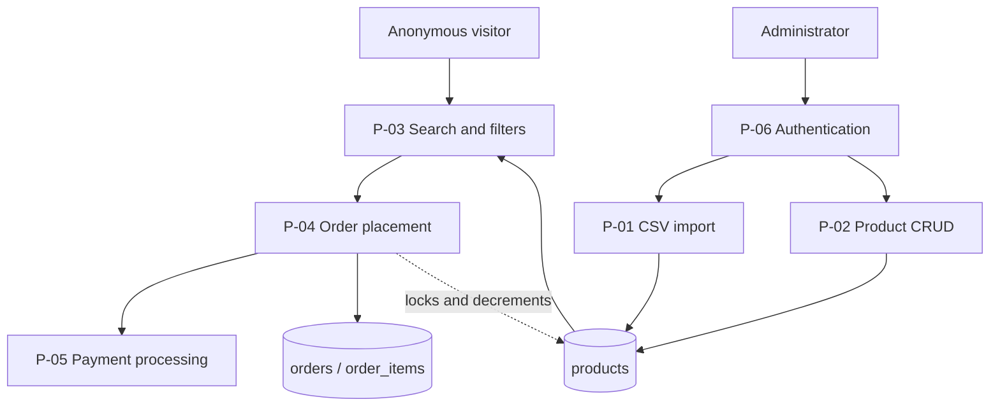

# System processes

One document per process the challenge asks for. Each traces a single flow end to end — actor,
steps, every file it touches, every validation applied and where, and what happens when each one
fails — so any step can be checked against the code rather than taken on trust.

> Written in English, like the root `README.md` and `docs/testing/`, because it doubles as review
> material. `docs/initial.md` and `openspec/` stay in Spanish.

## The processes

| # | Process | What it covers | Entry point |
|---|---|---|---|
| [P-01](P-01-csv-import.md) | **CSV import** | Upload, header check, per-row validation, upsert by SKU, duplicate rule, per-row report | `POST /products/import` |
| [P-02](P-02-product-crud.md) | **Product CRUD** | Create, read, update, delete; SKU uniqueness; XSS rejection; decimal handling | `/products` |
| [P-03](P-03-product-search.md) | **Search and filters** | Multi-term OR search, category, price range, availability, sorting, pagination | `GET /products` |
| [P-04](P-04-order-placement.md) | **Order placement** | Row locking, stock check, server-side total, price snapshot, idempotency | `POST /orders` |
| [P-05](P-05-payment-processing.md) | **Payment processing** | The provider contract, the fake implementation, decline handling, rollback | inside P-04 |
| [P-06](P-06-authentication.md) | **Authentication** | Login, JWT, the public/protected boundary, fail-closed guard | `/auth` |
| [P-07](P-07-error-contract.md) | **Error contract** | The response shape every failure shares, the code catalogue, database error translation | every endpoint |
| [P-08](P-08-security-hardening.md) | **Security hardening** | Security headers, explicit CORS, rate limiting, input rejection, and the known gaps | every request |

## How the processes relate



Buying is public and managing the catalog is not — the boundary is
[docs/initial.md](../initial.md) §10.2, and P-06 documents how it is enforced.

## Layers every request crosses

```
  LoggerMiddleware
    -> JwtAuthGuard          fail-closed; @Public() opts out
      -> ValidationPipe      whitelist + forbidNonWhitelisted + transform
        -> Controller        HTTP only: routes, status codes, Swagger
          -> Service         business rules; throws HttpExceptions
            -> Repository    TypeORM, parameterised queries
              -> Postgres    constraints as the last line of defence
```

Defence in depth is deliberate: the same rule is often enforced more than once, at different
distances from the data. A `UNIQUE` on `sku` exists on the entity **and** in the migration; the
application checks stock **and** the column has a `CHECK`. The outer layers give good error
messages; the innermost one is the guarantee.

## Reading a process document

Every document has the same shape:

| Section | What it answers |
|---|---|
| **Use case** | Who does this, and what they get |
| **Flow** | The sequence, as a diagram |
| **Files** | Every file involved, by layer, with its responsibility |
| **Validations** | Each rule, where it lives, and what it rejects |
| **Failure modes** | What can go wrong, the status code, and what the caller should do |
| **Verify it yourself** | Commands and code references to check each claim |

## Related documents

| Document | Content |
|---|---|
| [docs/initial.md](../initial.md) | Design spec: the decisions these processes implement |
| [docs/testing/](../testing/) | Manual test cases exercising these processes against a running stack |
| [openspec/specs/](../../openspec/specs/) | The requirements each process must satisfy, as scenarios |
| [README.md](../../README.md) | How to run the project, architecture summary, key decisions |
