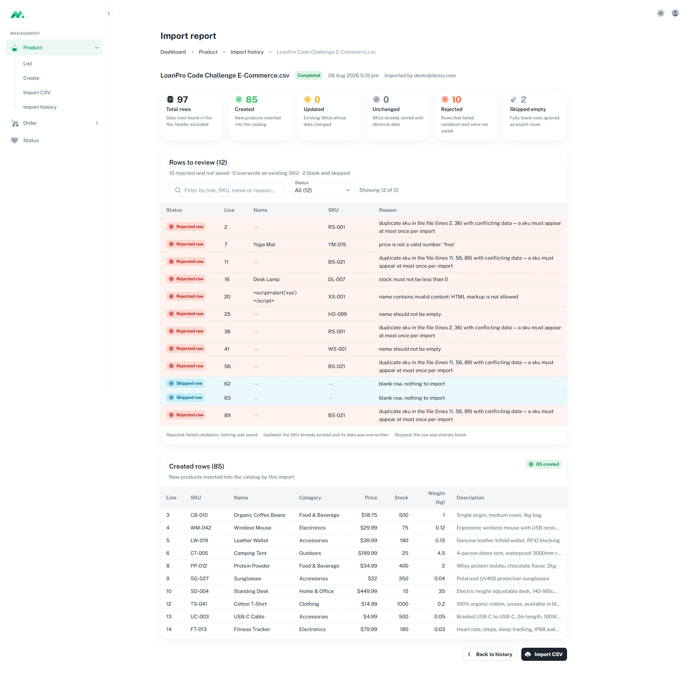
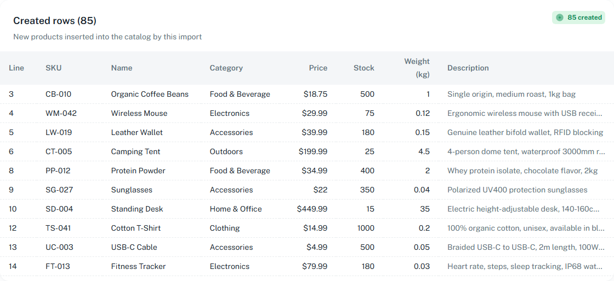

# TC-01 · Importación inicial sobre un catálogo vacío

| | |
|---|---|
| **Estado** | ✅ **Aprobado** |
| **Fecha** | 2026-08-28 |
| **Tickets** | TK-009, TK-023, TK-026, TK-033, TK-040, TK-042 |
| **Archivo** | `LoanPro Code Challenge E-Commerce.csv` (sin modificar, 97 filas de datos) |

## Objetivo

Verificar que una única importación del CSV del challenge sobre un catálogo vacío clasifica cada
fila correctamente, guarda solo las válidas, y reporta con precisión qué pasó con el resto —
incluidas las filas que rechazó deliberadamente.

Es el caso que ejercita todo el pipeline de una vez: validación de archivo, parseo, normalización
por fila, reglas del DTO, la regla de SKU duplicado y la persistencia.

## Precondiciones

```
  products         0
  import_batches   0
  user             1     (cuenta demo, intacta)
```

## Pasos

1. Inicia sesión en `http://localhost:3000` como `demo@demo.com`.
2. Ve a **Product → Import CSV**.
3. Sube el CSV del challenge sin modificar.

## Resultado esperado

### Resumen

| Métrica | Esperado |
|---|---|
| Filas totales | 97 |
| Creadas | 85 |
| Actualizadas | 0 |
| Sin cambios | 0 |
| Rechazadas | 10 |
| Vacías omitidas | 2 |

### Las diez filas rechazadas

Cinco fallan validación; cinco son las apariciones de dos SKU repetidos dentro del archivo.

| Línea | SKU | Motivo | Grupo |
|---|---|---|---|
| 2 | RS-001 | sku duplicado (líneas 2, 36) | duplicado |
| 7 | YM-015 | `price` no es un número válido: `free` | validación |
| 11 | BS-021 | sku duplicado (líneas 11, 56, 89) | duplicado |
| 16 | DL-007 | `stock` no puede ser menor que 0 | validación |
| 20 | XS-001 | `name` contiene marcado HTML | validación |
| 25 | HD-099 | `name` no debe estar vacío | validación |
| 36 | RS-001 | sku duplicado (líneas 2, 36) | duplicado |
| 41 | WS-001 | `name` no debe estar vacío (solo espacios) | validación |
| 56 | BS-021 | sku duplicado (líneas 11, 56, 89) | duplicado |
| 89 | BS-021 | sku duplicado (líneas 11, 56, 89) | duplicado |

Las líneas 62 y 63 están en blanco y deben aparecer como **omitidas**, no como errores.

### Filas que parecen problemas pero deben aceptarse

| Línea | Contenido | Esperado |
|---|---|---|
| 4 | `price` = `$29.99` | creada, símbolo retirado → `29.99` |
| 29 | `Robert'); DROP TABLE products;--` | creada; la consulta va parametrizada |
| 47 | `price` = `0.00` | creada; cero es un precio válido |
| 50 | `weight_kg` vacío | creada con `null`, nunca `0` |
| 51 | `stock` = 0 | creada; el único producto agotado |
| 52 | `category` vacía | creada como `Uncategorized` |
| 53 | coma dentro de un nombre entrecomillado | creada |
| 59 | comillas escapadas `""Inside""` | creada |
| 31 | `—` y `™` | creada |

## Criterios de aceptación

- [x] `Totales = Creadas + Actualizadas + Sin cambios + Rechazadas + Omitidas`
- [x] Exactamente 85 productos en el catálogo, repartidos en 18 categorías
- [x] `RS-001` y `BS-021` están **ausentes**: un SKU repetido se rechaza, no se hace upsert
- [x] El reporte lista **qué** líneas se omitieron, no solo cuántas
- [x] La línea 20 muestra el marcado ofensivo como texto plano en `Name`, nunca renderizado
- [x] Las líneas 25 y 41 muestran `—` en `Name`, que es en sí mismo el motivo del fallo
- [x] La tabla `Created rows` empieza en la línea 3, no en la 2
- [x] El filtro de estado acota la tabla y el contador reporta `Showing N of M`

## Resultado real

Coincidió exactamente con lo esperado.

```
  Total rows   97
  Created      85
  Updated       0
  Unchanged     0
  Rejected     10
  Skipped       2

  Rows to review (12)
  10 rejected and not saved · 0 overwrote an existing SKU · 2 blank and skipped
```

Verificado en la base de datos:

| Comprobación | Resultado |
|---|---|
| `select count(*) from products` | 85 |
| `select count(distinct category)` | 18 |
| `where sku in ('RS-001','BS-021')` | 0 filas |
| categoría de `GC-025` | `Uncategorized` |
| peso de `GK-088` | `null` |
| stock de `VC-001` | `0` |
| precio de `MB-001` | `0.00` |

Reparto por categoría de los 85 productos creados:

| Categoría | # | | Categoría | # |
|---|---|---|---|---|
| Electronics | 14 | | Stationery | 4 |
| Home & Office | 13 | | Books | 2 |
| Sports | 10 | | Footwear | 2 |
| Accessories | 9 | | Clothing | 1 |
| Beauty | 6 | | Gifts | 1 |
| Outdoors | 6 | | Health | 1 |
| Kitchen | 5 | | Pets | 1 |
| Food & Beverage | 4 | | Tools | 1 |
| Games | 4 | | Uncategorized | 1 |

`Footwear` tiene 2 en lugar de 3 porque `RS-001` fue rechazado, y `Misc` no aparece en absoluto:
su única fila era la 41.

## Evidencia





## Defectos encontrados

| Ticket | Resumen |
|---|---|
| TK-047 | Las filas rechazadas por la regla de SKU duplicado muestran `—` en `Name` aunque el archivo sí trae uno. `rejectDuplicateSkus` no propagaba el nombre, a diferencia de los otros dos caminos de rechazo. |
