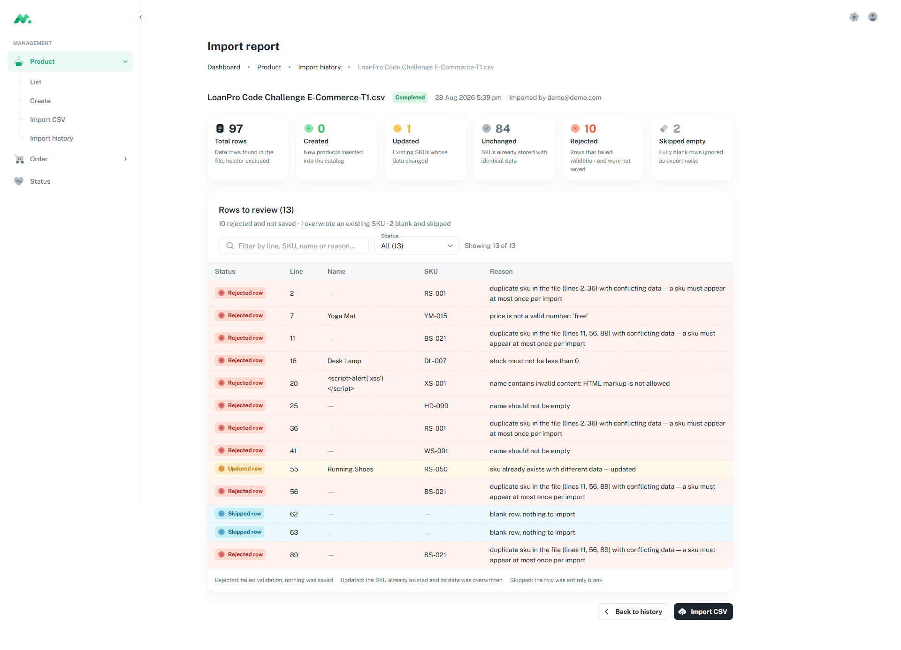

# TC-02 · Re-import with one product modified

| | |
|---|---|
| **Status** | ✅ **Passed** |
| **Date** | 2026-08-28 |
| **Tickets** | TK-009, TK-036, TK-039, TK-042 |
| **File** | `LoanPro Code Challenge E-Commerce-T1.csv` — the same 97 rows, one of them edited |

## Goal

Verify the upsert path: re-importing a catalog that already exists must update only what actually
changed, leave everything else untouched, and — this is the crucial part — make that single change
**findable** in the interface.

This is the case that justifies the `Updated at` column. An import that updates does not change the
size of the catalog, so without a way to sort by update date the change is invisible among 85 rows.

## Preconditions

TC-01 completed, so the catalog holds the 85 products from the original file.

```
  products         85
  RS-050 stored as:
    description   Budget running shoes for beginners
    price         49.99
    stock         200
    createdAt  =  updatedAt        (never modified)
```

## Test data

Line 55 of the file was changed, and only that line:

```diff
- Running Shoes,RS-050,Budget running shoes for beginners,Footwear,49.99,200,0.30
+ Running Shoes,RS-050,UPDATED DESCRIPTION,Footwear,59.99,150,0.30
```

Three of the six comparable fields differ: `description`, `price` and `stock`. `weight_kg` stays at
`0.30`, and `name` and `category` are untouched.

## Steps

1. Upload the edited file at **Product → Import CSV**.
2. Go to **Product → List** and search for `RS-050`.
3. Sort by **Updated at** descending.
4. Enable **Created at** from the *Columns* menu and sort by it descending.

## Expected result

| Metric | Expected | Why |
|---|---|---|
| Total rows | 97 | the file did not change size |
| Created | 0 | every SKU already exists |
| **Updated** | **1** | RS-050, line 55 |
| Unchanged | 84 | 85 minus RS-050 |
| Rejected | 10 | the same ten as TC-01, unaffected by the edit |
| Skipped empty | 2 | lines 62 and 63 |

The report table goes from 12 rows to **13**, and the new one is amber:

```
  Updated row   55   Running Shoes   RS-050   sku already exists with different data — updated
```

The `Created rows` table must **not render at all**: it only appears when something was inserted.

## Acceptance criteria

- [x] `0 + 1 + 84 + 10 + 2 = 97`
- [x] The catalog still holds 85 products — an update does not change its size
- [x] `RS-050` stores `59.99`, `150` and `UPDATED DESCRIPTION`
- [x] `createdAt` **did not change** and `updatedAt` moved forward
- [x] Sorting by `Updated at` descending puts RS-050 first
- [x] Sorting by `Created at` descending does **not** put it first
- [x] The updated row shows its name, unlike the ones rejected as duplicates (TK-047)

## Actual result

Matched the expectation exactly.

```
  Total rows   97
  Created       0
  Updated       1
  Unchanged    84
  Rejected     10
  Skipped       2

  Rows to review (13)
  10 rejected and not saved · 1 overwrote an existing SKU · 2 blank and skipped
```

Verified in the database:

```sql
select sku, description, price, stock, "createdAt" = "updatedAt" as untouched
from products where sku = 'RS-050';

 RS-050 | UPDATED DESCRIPTION | 59.99 | 150 | f
```

`untouched = f` is the proof: the two timestamps diverged, so the row was written, and `createdAt`
kept its original value.

## Why it matters

The import upserts by SKU. A row that already existed is **updated, not created**, so its creation
date never moves. Sorting the catalog by `Created at` — the only date column the dashboard had
before TK-036 — cannot surface what an import touched.

```
  order by Created at desc   ->  the same old products, RS-050 buried
  order by Updated at desc   ->  RS-050 first, alone, at the very top
```

That contrast is why `updatedAt` was added to the API's allow-list of sortable fields (TK-039) and
exposed as a column in the dashboard (TK-036).

## Evidence


