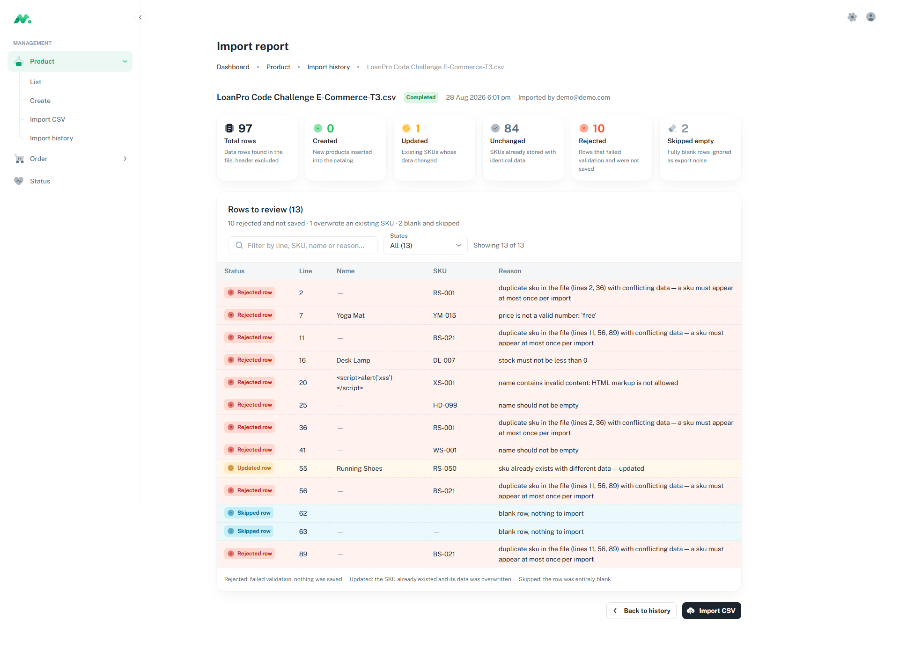
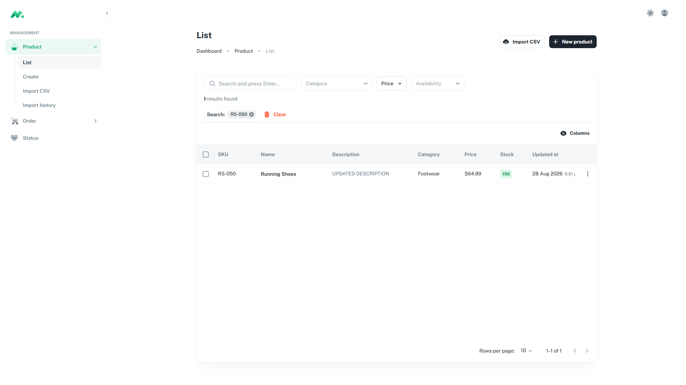

# TC-03 · `Unchanged` no escribe, `Updated` sí

| | |
|---|---|
| **Estado** | ✅ **Aprobado** |
| **Fecha** | 2026-08-28 |
| **Tickets** | TK-009, TK-036, TK-039 |
| **Archivos** | `...-T1.csv` (reimportación sin cambios) y `...-T3.csv` (un precio editado) |

## Objetivo

Demostrar que `Unchanged` significa **que la fila no se escribe en absoluto**, no "se escribe con
los mismos valores", y que un solo campo distinto basta para volcarla a `Updated`.

Es un test de una **ausencia**: verifica que algo *no* ocurre. El tamaño del catálogo no cambia en
ninguna dirección, y los contadores por sí solos no pueden distinguir los dos casos — solo la marca
de tiempo puede.

## Por qué la garantía es estructural

La rama de "sin cambios" del servicio incrementa el contador y no hace nada más. Nunca llama a
`save()`, así que el `@UpdateDateColumn` de TypeORM no tiene ocasión de dispararse. La marca de
tiempo no se reescribe con un valor idéntico: no se escribe.

## Precondiciones

TC-02 completado. El catálogo tiene 85 productos y RS-050 fue actualizado una vez.

```
  RS-050
    createdAt   2026-08-29 00:15:53.974713+00
    updatedAt   2026-08-29 00:39:46.895597+00   =  X
    price       59.99

  catalogo   85 productos, 1 con updatedAt movido
```

## Paso 1 — Reimportar exactamente el mismo archivo

Sube `...-T1.csv` sin tocarlo.

### Esperado

| Métrica | Esperado |
|---|---|
| Creadas | 0 |
| **Actualizadas** | **0** |
| Sin cambios | 85 |
| Rechazadas | 10 |
| Vacías omitidas | 2 |

Criterios de aceptación:

- [x] `RS-050.updatedAt == X` **al microsegundo**
- [x] Los productos con `updatedAt` movido siguen siendo 1 — sin escrituras colaterales
- [x] `max(updatedAt)` en todo el catálogo es **anterior** a la importación que se acaba de ejecutar

### Real

```
  lote 00:52:43   0 creadas · 0 actualizadas · 85 sin cambios · 10 rechazadas · 2 omitidas

  RS-050.updatedAt      2026-08-29 00:39:46.895597+00   identico a X
  filas con updatedAt movido   1 de 85
  max(updatedAt)        2026-08-29 00:39:46.895597+00   <- anterior al lote de las 00:52
```

Esa última línea es la evidencia más fuerte: el producto modificado más recientemente de todo el
catálogo sigue siendo más antiguo que la importación que acababa de procesar las 85 filas. No se
escribió nada — y no solo en el caso de RS-050.

## Paso 2 — Cambiar un único campo

`...-T3.csv` difiere de `...-T1.csv` en exactamente una celda:

```diff
- Running Shoes,RS-050,UPDATED DESCRIPTION,Footwear,59.99,150,0.30
+ Running Shoes,RS-050,UPDATED DESCRIPTION,Footwear,64.99,150,0.30
```

Uno de los seis campos comparables. La prueba más estricta posible del comparador.

### Esperado

| Métrica | Esperado |
|---|---|
| Creadas | 0 |
| **Actualizadas** | **1** |
| Sin cambios | 84 |
| Rechazadas | 10 |
| Vacías omitidas | 2 |

Criterios de aceptación:

- [x] `RS-050.price == 64.99`
- [x] `RS-050.updatedAt == Y` con `Y > X`
- [x] `RS-050.createdAt` intacto en `00:15:53.974713`
- [x] Los productos con `updatedAt` movido siguen siendo 1 — la actualización tocó una fila, no muchas

### Real

```
  lote 01:01:03   0 creadas · 1 actualizada · 84 sin cambios · 10 rechazadas · 2 omitidas

  price                 59.99  ->  64.99
  createdAt             2026-08-29 00:15:53.974713+00   intacto
  updatedAt             2026-08-29 01:01:03.507044+00   Y > X
  filas con updatedAt movido   1 de 85
  max(updatedAt)        2026-08-29 01:01:03.507044+00   <- posterior a la importacion
```

## La secuencia completa

Las cuatro importaciones se leen como un solo argumento continuo:

```
  00:15:53   85 creadas                RS-050.updatedAt = 00:15:53   nace
  00:39:46    1 actualizada, 84 iguales RS-050.updatedAt = 00:39:46   X   se movio
  00:52:43    0 actualizadas, 85 iguales RS-050.updatedAt = 00:39:46   X   NO se movio
  01:01:03    1 actualizada, 84 iguales RS-050.updatedAt = 01:01:03   Y   se movio
```

El tercer lote es el corazón del caso: 85 filas evaluadas, cero escrituras. El cuarto aporta el
contraste — el mismo archivo salvo por un campo, y la marca de tiempo avanza.

`max(updatedAt)` cuenta la misma historia sin ambigüedad:

| Tras el lote | `max(updatedAt)` | Lectura |
|---|---|---|
| 00:52 (todas sin cambios) | 00:39:46 | **anterior** a la importación — no se escribió nada |
| 01:01 (una actualizada) | 01:01:03 | **posterior** a la importación — se escribió exactamente una fila |

## Por qué importa

Sin este caso, `Unchanged` podría estar reescribiendo silenciosamente cada fila con valores
idénticos y los contadores se verían igual. Eso sería invisible en la UI, quemaría capacidad de
escritura en cada reimportación y destruiría el significado de `updatedAt` — la columna que TK-036
añadió precisamente para que un administrador encuentre lo que tocó una importación.

El caso protege además una segunda propiedad: que nada se escriba *colateralmente*. A lo largo de
las cuatro importaciones, exactamente un producto tuvo alguna vez `createdAt <> updatedAt`.

## Evidencia




